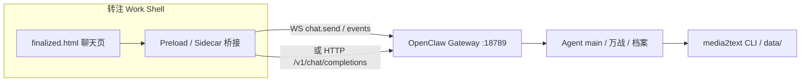

# OpenClaw Gateway 对接与桌面打包验证

转注 Work 对话框 ↔ OpenClaw Gateway，以及与 OpenClaw 一起打包成桌面端的两项**优先验证**清单。

设计原型（保留版本）：`~/.gstack/projects/oychao1988-media2text/designs/zhuanzhu-work-20260523/finalized.html`

---

## 1. 现状（2026-05-23 本机探测）

| 项 | 值 |
|----|-----|
| OpenClaw CLI | 2026.5.5（YonClaw 管理，`~/.local/bin/openclaw`） |
| Gateway 地址 | `ws://127.0.0.1:18789` / Dashboard `http://127.0.0.1:18789/` |
| 配置 | `~/.openclaw/openclaw.json` |
| 默认 agent | `main` |
| HTTP Chat API | `POST /v1/chat/completions`（已在配置中启用） |

### 已验证 ✅

```bash
# 前提：Gateway 在跑（见下文「启动 Gateway」）
source ~/.nvm/nvm.sh
openclaw health

# CLI → agent（端到端）
openclaw agent --agent main --message "回复两个字：收到" --json

# Gateway RPC → chat.send + history
./scripts/openclaw-gateway-chat.sh "用一句话介绍你自己"

# HTTP OpenAI 兼容接口（适合 Electron preload 代理）
./scripts/openclaw-gateway-http-chat.sh "说两个字：好的"
```

### 当前阻塞 ⚠️

**LaunchAgent 里的 Gateway 起不来**：plist 使用 `/usr/local/bin/node`（v22.12.0），OpenClaw 要求 **Node ≥ 22.14**。

```text
openclaw requires Node >=22.14.0.
Detected: node 22.12.0 (exec: /usr/local/bin/node).
```

**修复（任选其一）：**

```bash
# A. 用 nvm 重装 LaunchAgent（推荐）
source ~/.nvm/nvm.sh   # 当前 shell 已是 v22.17.0
openclaw gateway install --force

# B. 开发时手动前台跑（已验证可用）
source ~/.nvm/nvm.sh
openclaw gateway run --port 18789 --bind loopback
```

另有 **CLI 与 YonClaw 服务 config 路径不一致** 的警告；统一用 `~/.openclaw/openclaw.json` 或按 YonClaw 文档对齐 `OPENCLAW_STATE_DIR`。

---

## 2. 对话框 ↔ Gateway：推荐架构



### 两条对接路径（按优先级）

| 路径 | 适用 | 优点 | 注意 |
|------|------|------|------|
| **A. WebSocket RPC** | 正式产品、要流式/会话/工具事件 | 与 Accio / Control UI 一致；`chat.send` + `chat` 事件流 | 浏览器需 `controlUi.allowedOrigins` + 设备认证；Electron 用 preload 最省事 |
| **B. HTTP `/v1/chat/completions`** | **最快 PoC**、Electron preload | 已本机验证 200 + SSE 流式 | 跨域浏览器需代理；会话/工具能力弱于 WS |

### WebSocket 核心调用（Control UI 同款）

1. 连接 `ws://127.0.0.1:18789`
2. 收 `connect.challenge` → 发 `connect`（`auth.token` + `role: operator`）
3. 发 `chat.send`：`{ sessionKey, message, idempotencyKey }`
4. 订阅 `chat` 事件：`state: delta | final | error`
5. 历史：`chat.history` `{ sessionKey, limit }`

`sessionKey` 示例：`agent:main:main`（与 `openclaw health` 里 Session store 一致）。

协议全文：[Gateway protocol](https://docs.openclaw.ai/gateway/protocol)

### 转注 Work 映射

| UI | Gateway |
|----|---------|
| 左侧会话 | `sessionKey`（可按 agent 前缀：`agent:main:…`） |
| 智能体切换（万战/档案/女娲） | `agents.list` + 不同 workspace / system prompt（后续） |
| `@transcript.md` | 拼进 `message` 或 `chat.inject` |
| 档案检索结果 | 作为 user 消息上下文，或 media2text skill 工具 |

---

## 3. 桌面打包：与 OpenClaw 一起分发

参考实现：[agentkernel/openclaw-desktop](https://github.com/agentkernel/openclaw-desktop)（Electron + 内置 Node + OpenClaw npm + 安装向导）。

### 推荐方案（Mac 优先）

**Electron 薄壳 +  bundled OpenClaw + 转注 UI**

```
转注 Work.app
├── Electron main
│   ├── 启动/escription subprocess（bundled Node ≥22.16）
│   ├── 健康检查 ws://127.0.0.1:18789
│   └── preload：openclaw.chat / openclaw.health
├── Renderer：finalized.html（或 Vite 化）
├── Resources/openclaw/     # pin 版本，同 openclaw-desktop
└── Resources/node/         # portable Node
```

与 YonClaw / Accio 同族：你本机已有 **YonClaw.app**、**Accio.app**，可对照其 Gateway LaunchAgent 与 `OPENCLAW_STATE_DIR` 布局。

### 打包验证里程碑

| 阶段 | 目标 | 通过标准 |
|------|------|----------|
| **P0** | 开发态联调 | `finalized.html` 发一条消息 → Gateway → 助手回复（脚本或 preload） |
| **P1** | 单进程启动 | 双击 app → Gateway 自动 ready → 聊天可用 |
| **P2** | 安装包 | `.dmg` / `.exe`；`~/.openclaw` 配置与升级策略文档化 |
| **P3** | media2text 集成 | preload 调 `media2text` CLI（`archive search`、`monitor watch` 状态） |

### Tauri 备选（CEO 计划 P1）

- Rust 壳 + **sidecar**：`openclaw gateway` + Python `media2text`
- 聊天仍走 localhost Gateway，不重复实现 agent 运行时
- 打包体积更小，但需自行解决 Node sidecar 与 OpenClaw 版本 pin

### 不建议

- 在壳里重写 agent 逻辑（应始终走 Gateway）
- 浏览器裸连跨域 Gateway（无 preload / 未配 `allowedOrigins`）

---

## 4. 本地验证命令速查

```bash
source ~/.nvm/nvm.sh
source .venv/bin/activate   # media2text 项目根

# 1) Gateway
openclaw gateway run --port 18789 --bind loopback   # 或 gateway install --force 后 gateway start

# 2) 健康
openclaw health
openclaw gateway status

# 3) 聊天 PoC
./scripts/openclaw-gateway-chat.sh "测试"
./scripts/openclaw-gateway-http-chat.sh "测试"

# 4) 打开 Control UI（对照 Accio 行为）
open http://127.0.0.1:18789/
```

---

## 5. Electron 开发壳

转注 Work 最小 Electron 聊天壳（Issue #35）：preload 代理 `POST /v1/chat/completions`，开发态联调 Gateway。

- 说明与运行步骤：[desktop/zhuanzhu-work/README.md](../desktop/zhuanzhu-work/README.md)

---

## 6. 下一步（建议顺序）

1. **修 LaunchAgent Node 版本** → `openclaw gateway install --force`（nvm 22.17 环境下）
2. **Electron 开发壳**（`desktop/zhuanzhu-work`）：聊天 UI + preload HTTP 联调 ✅（Issue #35）
3. **会话/agent 映射**：万战 lens → OpenClaw agent 或 system prompt + skill 路径
4. **media2text sidecar**：preload 执行 `media2text archive search --json`，结果注入聊天

---

## 7. 安全

- Gateway token 放在 `.env` / Keychain，**勿提交** `openclaw.json` 中的 token
- 打包 app 仅 bind `loopback`；远程访问走 Tailscale / 显式配置
- 转注合规文案保留在 UI footer；工具能力受 OpenClaw operator scope 约束
