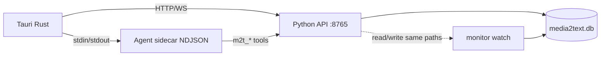

# m2t-desktop Implementation Plan

> **For agentic workers:** REQUIRED SUB-SKILL: Use superpowers:subagent-driven-development (recommended) or superpowers:executing-plans to implement this plan task-by-task. Steps use checkbox (`- [ ]`) syntax for tracking.

**Goal:** Ship a macOS-first Tauri desktop app that wraps existing media2text via a local FastAPI sidecar (:8765), embeds live FLV playback + partial transcript WS, and adds a pi-coding-agent Node sidecar for SQLite-backed Agent chat—matching [finalized.html](../designs/m2t-desktop/finalized.html).

**Architecture:** Python `media2text.api` reuses `core.*` (no CLI subprocess for reads/writes). Tauri spawns Python API then Node `m2t-agent-sidecar`; React UI talks HTTP/WS to Python and `listen("agent-event")` for LLM. Daemon remains `monitor watch --daemon`. UI field ↔ yaml mapping per [design §4.7.3](../specs/2026-06-04-m2t-desktop-design.md#473-ui-字段--configyaml-完整映射).

**Tech Stack:** Python 3.12+ (FastAPI, uvicorn, httpx), Tauri 2, React 18, TypeScript, Tailwind, flv.js, Zustand/React Query, Node 20+ (`@earendil-works/pi-coding-agent`), pnpm workspaces, pytest, Vitest (frontend unit).

**Spec:** [2026-06-04-m2t-desktop-design.md](../specs/2026-06-04-m2t-desktop-design.md) · UI: [ui-design](../specs/2026-06-04-m2t-desktop-ui-design.md) · [config-manage-ia](../specs/2026-06-04-m2t-desktop-config-manage-ia.md)

**Reference fork (local):** `/Users/Oychao/Documents/Projects/scmclaw-v2` — copy `packages/pi-sidecar`, `usePiSidecar.ts`, `pi_sidecar.rs` patterns; adapt tools to `m2t_*` → `:8765`.

**Scope note:** One plan, **11 internal phases** (design §10). Each phase yields testable software. Defer Windows/Linux packaging, App Store signing, download-queue UI, in-app stop-recording button (API + Agent tool only).

---

## File map

| Path | Responsibility |
|------|----------------|
| `pyproject.toml` | Add `[project.optional-dependencies] desktop = [...]`; optional `serve` script |
| `src/media2text/core/config.py` | `live.auto_record`, `desktop.*`, `platforms.douyin.live_poll_interval_sec`, `summarize.llm.default_provider/default_model` |
| `config.example.yaml` | Document new keys |
| `src/media2text/core/storage/db.py` | `_migrate_desktop_v1`: `creator_live_snapshots`, `desktop_chat_*`, `creators.auto_record_override` |
| `src/media2text/core/storage/models.py` | `CreatorRow.auto_record_override`, snapshot/chat row dataclasses |
| `src/media2text/core/storage/repos.py` | `LiveSnapshotRepo`, `DesktopChatRepo`, creator override updates |
| `src/media2text/core/desktop/auto_record.py` | `effective_auto_record(creator, cfg) -> bool` |
| `src/media2text/core/desktop/status_lights.py` | Map DB → `green|yellow|red|gray` + `is_live` |
| `src/media2text/core/live/recording.py` | Gate `scan_and_start` on `effective_auto_record`; public `start_recording_for_creator` |
| `src/media2text/core/platform/douyin/live.py` | Per-platform live poll interval |
| `src/media2text/core/summarize/openai_backend.py` | Honor `default_provider` / `default_model` |
| `src/media2text/api/__init__.py` | Package marker |
| `src/media2text/api/app.py` | FastAPI factory, CORS off, lifespan |
| `src/media2text/api/deps.py` | `get_cfg()`, `get_conn()` per-request |
| `src/media2text/api/security.py` | `safe_workspace_path(ws, rel) -> Path` |
| `src/media2text/api/config_dto.py` | camelCase ↔ `AppConfig` roundtrip |
| `src/media2text/api/routes/health.py` | `/api/health`, `/api/doctor/run` |
| `src/media2text/api/routes/daemon.py` | start/stop/logs/status |
| `src/media2text/api/routes/creators.py` | CRUD, sync, recording, sessions |
| `src/media2text/api/routes/sessions.py` | transcript, stream proxy, WS |
| `src/media2text/api/routes/media.py` | Range file serve |
| `src/media2text/api/routes/config.py` | GET/PATCH config |
| `src/media2text/api/routes/auth.py` | login spawn, status |
| `src/media2text/api/routes/chat.py` | threads/messages/providers |
| `src/media2text/api/routes/events.py` | WS broadcast hub |
| `src/media2text/api/services/daemon.py` | PID lock, spawn/kill |
| `src/media2text/api/services/transcript.py` | Read partial/final JSON/md |
| `src/media2text/api/services/flv_proxy.py` | httpx stream + cookie inject |
| `src/media2text/cli/serve.py` | `media2text serve --port 8765` |
| `src/media2text/cli/main.py` | Register `serve` |
| `tests/unit/test_desktop_*.py` | Core + API unit tests |
| `tests/unit/test_api_*.py` | Route tests with TestClient |
| `pnpm-workspace.yaml` | `packages/*`, `apps/*` |
| `packages/shared/` | `PiEvent` types (copy from scmclaw) |
| `packages/m2t-agent-sidecar/` | Node agent: tools, context, NDJSON IPC |
| `packages/agent-skills/media2text/SKILL.md` | Agent skill v1 |
| `apps/m2t-desktop/` | Tauri 2 + React app |
| `apps/m2t-desktop/src-tauri/src/python_sidecar.rs` | Spawn/kill Python API |
| `apps/m2t-desktop/src-tauri/src/agent_sidecar.rs` | NDJSON stdin/stdout → events |
| `apps/m2t-desktop/src/features/layout/` | 三栏、折叠、AppBootstrap、localStorage |
| `apps/m2t-desktop/src/lib/toast.ts` | 全局 toast（§8 错误反馈） |
| `apps/m2t-desktop/src/features/creators/StatusLight.tsx` | 灯 + abbr + aria |
| `apps/m2t-desktop/src/features/creators/` | 左栏列表 + 状态灯 |
| `apps/m2t-desktop/src/features/daemon/` | DaemonCard |
| `apps/m2t-desktop/src/features/live/` | 直播 Tab、RecordBanner、flv.js |
| `apps/m2t-desktop/src/features/history/` | 历史列表 + 回放 |
| `apps/m2t-desktop/src/features/transcript/` | 转写/摘要 Markdown + WS |
| `apps/m2t-desktop/src/features/config/` | 四段配置表单 |
| `apps/m2t-desktop/src/features/manage/` | 管理列表 + 抽屉 |
| `apps/m2t-desktop/src/features/agent/` | useM2tAgent, Composer |

---

## Phase 0 — Core prerequisites (blocks API + daemon semantics)

### Task 1: Config fields for desktop

**Files:**
- Modify: `src/media2text/core/config.py`
- Modify: `config.example.yaml`
- Test: `tests/unit/test_desktop_config.py`

- [ ] **Step 1: Write failing test**

```python
# tests/unit/test_desktop_config.py
from media2text.core.config import AppConfig


def test_live_auto_record_defaults_true() -> None:
    cfg = AppConfig.model_validate({"live": {}})
    assert cfg.live.auto_record is True


def test_douyin_live_poll_interval() -> None:
    cfg = AppConfig.model_validate(
        {"platforms": {"douyin": {"live_poll_interval_sec": 15}}}
    )
    assert cfg.platforms.douyin.live_poll_interval_sec == 15


def test_summarize_default_provider_model() -> None:
    cfg = AppConfig.model_validate(
        {
            "summarize": {
                "llm": {
                    "default_provider": "nvidia",
                    "default_model": "deepseek-ai/deepseek-v4-pro",
                }
            }
        }
    )
    assert cfg.summarize.llm.default_provider == "nvidia"
    assert cfg.summarize.llm.default_model == "deepseek-ai/deepseek-v4-pro"


def test_desktop_section() -> None:
    cfg = AppConfig.model_validate({"desktop": {"api_port": 8765}})
    assert cfg.desktop.api_port == 8765
    assert cfg.desktop.chat.default_model == "auto"
```

- [ ] **Step 2: Run test — expect FAIL**

Run: `source .venv/bin/activate && pytest tests/unit/test_desktop_config.py -v`  
Expected: FAIL (`auto_record` / `desktop` / `live_poll_interval_sec` missing)

- [ ] **Step 3: Add models to config.py**

Add to `LiveConfig`: `auto_record: bool = True`  
Add to `DouyinPlatformConfig`: `live_poll_interval_sec: int = 0`  
Add to `SummarizeLlmConfig`: `default_provider: str | None = None`, `default_model: str | None = None`  
Add new:

```python
class DesktopChatConfig(BaseModel):
    default_model: str = "auto"
    max_context_chars: int = 24000


class DesktopConfig(BaseModel):
    api_port: int = 8765
    theme: str = "light"
    chat: DesktopChatConfig = Field(default_factory=DesktopChatConfig)
```

Wire `desktop: DesktopConfig = Field(default_factory=DesktopConfig)` on `AppConfig`.

Update `config.example.yaml` with `live.auto_record`, `platforms.douyin.live_poll_interval_sec`, `summarize.llm.default_*`, `desktop:` block per design §4.7.

- [ ] **Step 4: Run test — expect PASS**

Run: `pytest tests/unit/test_desktop_config.py -v`

- [ ] **Step 5: Commit**

```bash
git add src/media2text/core/config.py config.example.yaml tests/unit/test_desktop_config.py
git commit -m "feat(desktop): add config fields for auto_record and desktop section"
```

---

### Task 2: DB migration desktop_v1

**Files:**
- Modify: `src/media2text/core/storage/db.py`
- Modify: `src/media2text/core/storage/models.py`
- Modify: `src/media2text/core/storage/repos.py`
- Test: `tests/unit/test_desktop_db_migration.py`

- [ ] **Step 1: Write failing test**

```python
# tests/unit/test_desktop_db_migration.py
from media2text.core.storage.db import connect


def test_desktop_v1_tables_exist(tmp_path) -> None:
    conn = connect(tmp_path / "media2text.db")
    tables = {
        r[0]
        for r in conn.execute(
            "SELECT name FROM sqlite_master WHERE type='table'"
        ).fetchall()
    }
    assert "creator_live_snapshots" in tables
    assert "desktop_chat_threads" in tables
    assert "desktop_chat_messages" in tables
    cols = {r[1] for r in conn.execute("PRAGMA table_info(creators)").fetchall()}
    assert "auto_record_override" in cols
    conn.close()
```

- [ ] **Step 2: Run — expect FAIL**

Run: `pytest tests/unit/test_desktop_db_migration.py -v`

- [ ] **Step 3: Implement `_migrate_desktop_v1`**

SQL from design §4.6.8; call from existing migrate chain after `_migrate_live_sessions_v4`. Extend `CreatorRow` with `auto_record_override: str = "inherit"`. Add minimal repos: `LiveSnapshotRepo.upsert/get`, `DesktopChatRepo` thread/message CRUD.

- [ ] **Step 4: Run — expect PASS**

Run: `pytest tests/unit/test_desktop_db_migration.py -v`

- [ ] **Step 5: Commit**

```bash
git add src/media2text/core/storage/ tests/unit/test_desktop_db_migration.py
git commit -m "feat(desktop): sqlite migration for snapshots and chat tables"
```

---

### Task 3: effective_auto_record + scan gate

**Files:**
- Create: `src/media2text/core/desktop/auto_record.py`
- Modify: `src/media2text/core/live/recording.py`
- Test: `tests/unit/test_effective_auto_record.py`

- [ ] **Step 1: Write failing test**

```python
# tests/unit/test_effective_auto_record.py
from dataclasses import replace

from media2text.core.config import AppConfig
from media2text.core.desktop.auto_record import effective_auto_record
from media2text.core.storage.models import CreatorRow


def _creator(override: str = "inherit") -> CreatorRow:
    return CreatorRow(
        id="c1",
        platform="douyin",
        sec_uid="s1",
        display_name="t",
        profile_url=None,
        watch_live=0,
        monitor_enabled=1,
        unique_id=None,
        avatar_url=None,
        signature=None,
        follower_count=None,
        profile_synced_at=None,
        created_at="2026-01-01T00:00:00Z",
        auto_record_override=override,
    )


def test_inherit_follows_global() -> None:
    cfg = AppConfig.model_validate({"live": {"auto_record": False}})
    assert effective_auto_record(_creator("inherit"), cfg) is False
    cfg2 = AppConfig.model_validate({"live": {"auto_record": True}})
    assert effective_auto_record(_creator("inherit"), cfg2) is True


def test_override_on_off() -> None:
    cfg = AppConfig.model_validate({"live": {"auto_record": False}})
    assert effective_auto_record(_creator("on"), cfg) is True
    assert effective_auto_record(_creator("off"), cfg) is False
```

- [ ] **Step 2: Run — expect FAIL**

Run: `pytest tests/unit/test_effective_auto_record.py -v`

- [ ] **Step 3: Implement**

```python
# src/media2text/core/desktop/auto_record.py
from media2text.core.config import AppConfig
from media2text.core.storage.models import CreatorRow


def effective_auto_record(creator: CreatorRow, cfg: AppConfig) -> bool:
    o = (creator.auto_record_override or "inherit").lower()
    if o == "on":
        return True
    if o == "off":
        return False
    return bool(cfg.live.auto_record)
```

In `recording.py` `scan_and_start`, after `live_info.is_live` check and **before** `_start_recording`, add:

```python
from media2text.core.desktop.auto_record import effective_auto_record
# ...
if not effective_auto_record(creator, self._cfg):
    continue
```

Add test in `tests/unit/test_live_recording_auto_record.py` mocking `_start_recording` to assert not called when global false + inherit.

- [ ] **Step 4: Run tests — expect PASS**

Run: `pytest tests/unit/test_effective_auto_record.py tests/unit/test_live_recording_auto_record.py -v`

- [ ] **Step 5: Commit**

```bash
git add src/media2text/core/desktop/auto_record.py src/media2text/core/live/recording.py tests/
git commit -m "feat(desktop): gate auto start recording on effective_auto_record"
```

---

### Task 4: Douyin per-platform live poll

**Files:**
- Modify: `src/media2text/core/platform/douyin/live.py`
- Test: `tests/unit/test_douyin_live_poll.py`

- [ ] **Step 1: Write failing test** — `run_daemon` uses `platforms.douyin.live_poll_interval_sec` when set, else global.

- [ ] **Step 2: Run — FAIL**

- [ ] **Step 3: Change poll resolution** in `run_daemon` to mirror bilibili: `cfg.platforms.douyin.live_poll_interval_sec or cfg.live.live_poll_interval_sec or cfg.monitor.live_poll_interval_sec`.

- [ ] **Step 4: PASS**

- [ ] **Step 5: Commit** — `feat(desktop): douyin platform live poll interval`

---

## Phase 1 — Python API package skeleton

### Task 5: desktop extra + FastAPI app factory

**Files:**
- Modify: `pyproject.toml`
- Create: `src/media2text/api/app.py`, `deps.py`, `__init__.py`, `__main__.py`
- Create: `src/media2text/cli/serve.py`
- Modify: `src/media2text/cli/main.py`
- Test: `tests/unit/test_api_health.py`

- [ ] **Step 1: Write failing test**

```python
# tests/unit/test_api_health.py
from fastapi.testclient import TestClient

from media2text.api.app import create_app


def test_health_ok() -> None:
    client = TestClient(create_app())
    r = client.get("/api/health")
    assert r.status_code == 200
    body = r.json()
    assert body["ok"] is True
    assert "checks" in body
```

- [ ] **Step 2: Run — FAIL** (`ModuleNotFoundError: fastapi`)

- [ ] **Step 3: Add dependency + app**

`pyproject.toml`:

```toml
desktop = ["fastapi>=0.110", "uvicorn[standard]>=0.27", "websockets>=12.0"]
```

`create_app()` mounts router prefix `/api`, binds `127.0.0.1` only in `serve` CLI.

`cli/serve.py`:

```python
import uvicorn
import typer

app_cli = typer.Typer()


@app_cli.callback()
def serve(port: int = typer.Option(8765, "--port")) -> None:
    uvicorn.run("media2text.api.app:create_app", factory=True, host="127.0.0.1", port=port)
```

Register in `cli/main.py`: `app.add_typer(serve.app_cli, name="serve")`.

- [ ] **Step 4: Run** — `pip install -e ".[desktop,dev]" && pytest tests/unit/test_api_health.py -v`

- [ ] **Step 5: Commit** — `feat(desktop): FastAPI skeleton and media2text serve`

---

### Task 6: safe_workspace_path

**Files:**
- Create: `src/media2text/api/security.py`
- Test: `tests/unit/test_api_security.py`

- [ ] **Step 1: Failing tests** — reject `../etc/passwd`, accept `creators/x/live/y.flv`.

- [ ] **Step 2: Run — FAIL**

- [ ] **Step 3: Implement** resolve under workspace realpath; raise `HTTPException(400)` on escape.

- [ ] **Step 4: PASS**

- [ ] **Step 5: Commit**

---

### Task 7: config_dto roundtrip

**Files:**
- Create: `src/media2text/api/config_dto.py`
- Create: `src/media2text/api/routes/config.py`
- Test: `tests/unit/test_config_dto.py`

- [ ] **Step 1: Test** `config_to_dto(cfg)` includes `livePollInterval`, `autoRecord`; `apply_dto_patch(cfg, {"theme": "dark"})` sets `desktop.theme`; webhook empty string does not clear unless `clearFeishuWebhook: true`.

- [ ] **Step 2–4: Implement** full mapping table from design §4.7.3; `GET /api/config`, `PATCH /api/config` with pydantic model `ConfigPatchDto`.

- [ ] **Step 5: Commit**

---

## Phase 2 — API: daemon, creators, status lights

### Task 8: Daemon routes

**Files:**
- Create: `src/media2text/api/services/daemon.py`
- Create: `src/media2text/api/routes/daemon.py`
- Test: `tests/unit/test_api_daemon.py`

- [ ] **Step 1: Test** `GET /api/daemon` returns `{running, pid, post_process_pending}` using temp lock file; `GET /api/daemon/logs?tail=5` reads log tail (mock file).

- [ ] **Step 2–4: Implement** `start` → `subprocess.Popen([sys.executable, "-m", "media2text", "monitor", "watch", "--daemon"], cwd=...)`; `stop` → read PID from `data/.monitor-watch.lock` + SIGTERM (reuse logic from `cli/live.py` `_read_daemon_pid`).

- [ ] **Step 5: Commit**

---

### Task 9: Status lights aggregator

**Files:**
- Create: `src/media2text/core/desktop/status_lights.py`
- Test: `tests/unit/test_status_lights.py`

- [ ] **Step 1: Tests** — active ffmpeg → green; snapshot live + no session → red; offline_since → yellow; else gray.

- [ ] **Step 2–4: Implement** pure function `(creator, active_session, snapshot) -> dict`.

- [ ] **Step 5: Commit**

---

### Task 10: GET /api/creators (+ ?all=1)

**Files:**
- Create: `src/media2text/api/routes/creators.py`
- Test: `tests/unit/test_api_creators_list.py`

- [ ] **Step 1: Test** with fixture DB — monitored-only default; `?all=1` returns unmonitored; JSON includes `status_light`, `avatar_url`, `live_snapshot`.

- [ ] **Step 2–4: Implement** join `LiveSnapshotRepo`, `LiveSessionRepo.list_active_for_creator`.

- [ ] **Step 5: Commit**

---

### Task 11: Creator CRUD + PATCH override

**Files:**
- Modify: `src/media2text/api/routes/creators.py`
- Test: `tests/unit/test_api_creators_crud.py`

- [ ] **Step 1: Tests** — `PATCH` sets `monitor_enabled`, `auto_record_override`; invalid override → 400.

- [ ] **Step 2–4: Wire** to `CreatorRepo`; `POST /api/creators` calls existing `creator.add` service logic (extract from `cli/creator.py` into `core/creator/service.py` if needed to avoid subprocess).

- [ ] **Step 5: Commit**

---

### Task 12: Sync + DELETE + auth routes

**Files:**
- Modify: `creators.py`; Create: `routes/auth.py`
- Tests: `test_api_creators_sync.py`, `test_api_auth.py`

- [ ] **Implement** `POST .../sync-profile`, `/sync`, `/sync-dynamics` wrapping CLI-equivalent core functions.

- [ ] **`DELETE /api/creators/{id}`** with optional `delete_media` query.

- [ ] **`GET /api/auth/status`**, `POST /api/auth/login/{platform}` spawn terminal (stub in unit tests: returns `{spawned: true}`).

- [ ] **Commit**

---

## Phase 3 — API: sessions, transcript, media, FLV proxy

### Task 13: Transcript read service

**Files:**
- Create: `src/media2text/api/services/transcript.py`
- Create: `routes/sessions.py` (partial)
- Test: `tests/unit/test_api_transcript.py`

- [ ] **Step 1: Test** fixture partial.json + final.md paths via session row.

- [ ] **Step 2–4: `GET /api/sessions/{id}/transcript`** returns `{partial, segments, text}`.

- [ ] **Step 5: Commit**

---

### Task 14: Transcript WebSocket

**Files:**
- Modify: `routes/sessions.py`
- Test: `tests/unit/test_api_transcript_ws.py`

- [ ] **Implement** WS loop: poll mtime every 2s or watchdog; push JSON on change; close on session finalize.

- [ ] **Commit**

---

### Task 15: GET /api/media (Range)

**Files:**
- Create: `routes/media.py`
- Test: `tests/unit/test_api_media.py`

- [ ] **Support** `Range` header for mp4/flv; `Content-Type` by extension.

- [ ] **Commit**

---

### Task 16: FLV stream proxy

**Files:**
- Create: `src/media2text/api/services/flv_proxy.py`
- Modify: `routes/sessions.py`
- Test: `tests/unit/test_api_flv_proxy.py` (httpx mock transport)

- [ ] **`GET /api/sessions/{id}/stream/proxy`** streams upstream; inject Referer/Cookie from platform session files; 403 → retry resolve once.

- [ ] **Commit**

---

### Task 17: Sessions list + live-groups

**Files:**
- Extend: `routes/creators.py`
- Test: `tests/unit/test_api_sessions_list.py`

- [ ] **`GET /api/creators/{id}/sessions`** merge DB + manifest; filters `has_transcript`, `has_summary`; **`live_groups`** from manifest.

- [ ] **`GET /api/live/status`** reuse `cli/live.py status` field builder (extract shared `build_live_status()`).

- [ ] **Commit**

---

## Phase 4 — API: recording, snapshots, chat, events WS

### Task 18: Manual recording start/stop

**Files:**
- Modify: `src/media2text/core/live/recording.py` — add public `start_recording_for_creator(creator_id) -> dict`
- Modify: `routes/creators.py`
- Test: `tests/unit/test_api_recording_start.py`

- [ ] **Tests** — 409 when already recording / not live; success creates session row (mock adapter live fixture).

- [ ] **`POST recording/start|stop`** call core methods.

- [ ] **Commit**

---

### Task 19: Live snapshot upsert (daemon hook)

**Files:**
- Modify: `src/media2text/core/live/recording.py` or platform live watchers
- Create: `src/media2text/api/services/live_snapshot.py`
- Test: `tests/unit/test_live_snapshot_repo.py`

- [ ] **After each poll** upsert `creator_live_snapshots`; API `POST .../live/refresh` for on-demand (rate limit 30s).

- [ ] **Commit**

---

### Task 20: Chat persistence routes

**Files:**
- Create: `routes/chat.py`
- Test: `tests/unit/test_api_chat.py`

- [ ] **CRUD** threads/messages per design §5; `GET /api/chat/providers` from summarize.llm.

- [ ] **Commit**

---

### Task 21: Events WebSocket hub

**Files:**
- Create: `routes/events.py`
- Test: `tests/unit/test_api_events_ws.py`

- [ ] **Broadcast** `{type: "daemon"|"creator_status", ...}`; daemon start/stop and recording start emit from route handlers (simple in-process pubsub).

- [ ] **Commit**

---

## Phase 5 — Tauri shell + Python sidecar lifecycle

### Task 22: Scaffold apps/m2t-desktop

**Files:**
- Create: `apps/m2t-desktop/` via `pnpm create tauri-app` (React+TS)
- Create: `pnpm-workspace.yaml`
- Modify: `.gitignore` — `apps/m2t-desktop/node_modules`, `target/`

- [ ] **Step 1:** From repo root: `pnpm init`; workspace packages `packages/*`, `apps/*`.

- [ ] **Step 2:** Scaffold Tauri 2 app at `apps/m2t-desktop`; Tailwind + postcss config.

- [ ] **Step 3:** Add dev script `pnpm --filter m2t-desktop dev`.

- [ ] **Step 4:** Verify empty window launches.

- [ ] **Step 5: Commit** — `chore(desktop): scaffold Tauri React app`

---

### Task 23: Python sidecar from Tauri

**Files:**
- Create: `apps/m2t-desktop/src-tauri/src/python_sidecar.rs`
- Modify: `apps/m2t-desktop/src-tauri/src/lib.rs`

- [ ] **Spawn** `{venv}/python -m media2text serve --port 8765` on app start; poll `GET /api/health` until ok or timeout; kill on exit.

- [ ] **Expose** Tauri command `get_api_base_url() -> String`.

- [ ] **Manual test:** app start → curl localhost:8765/api/health.

- [ ] **Commit**

---

## Phase 6 — React layout shell (match finalized.html)

### Task 24: Design tokens + layout grid + AppBootstrap

**Files:**
- Create: `apps/m2t-desktop/src/styles/tokens.css` (port CSS variables from finalized.html)
- Create: `apps/m2t-desktop/src/features/layout/AppShell.tsx`
- Create: `apps/m2t-desktop/src/features/layout/AppBootstrap.tsx` (sidecar 启动遮罩)
- Create: `apps/m2t-desktop/src/features/layout/useLayoutStore.ts`
- DevDep: `@fontsource/geist-sans`, `@fontsource/jetbrains-mono`

- [ ] **Implement** 5-column grid, resize grips, `SIZE_LIMITS`, persist `m2t-desktop-layout`（对齐 ui-design §4.4）。

- [ ] **Fonts (方案 A):** UI = Geist Sans；mono = JetBrains Mono；**禁止** v1 默认 Inter。

- [ ] **Default theme** `data-theme="light"`; read/write `m2t-desktop-theme`; `#cfg-theme` 即时切换（Task 32 接线）。

- [ ] **AppBootstrap states**（架构 §8 第 1 行）：`loading` 全屏「正在启动服务…」+ spinner；`error` 文案 + 重试（调 Tauri `restart_python_sidecar` 或 reload）；`ready` 渲染三栏。

- [ ] **Vitest:** `AppBootstrap.test.tsx` — mock health pending/ok/fail。

- [ ] **Commit**

---

### Task 25: Side rails + collapse

**Files:**
- `LeftRail.tsx`, `RightRail.tsx`, `SidePanelHeader.tsx`
- `features/creators/CreatorListEmpty.tsx`

- [ ] **Match** UI spec §4.3 — rail dots, `#rail-daemon` expands left panel, `#rail-user-menu` opens menu only.

- [ ] **Empty list:** `GET /api/creators` 返回 `[]` 或全无 `monitor_enabled` → 显示「暂无监控博主」+ CTA「添加博主」→ `view-manage`（原型 `#creator-list-empty`）。

- [ ] **Loading:** 左栏 skeleton ×3（状态矩阵）。

- [ ] **Commit**

---

### Task 26: Center view router

**Files:**
- `CenterToolbar.tsx`, views: `ViewLive`, `ViewHistory`, `ViewConfig`, `ViewManage`

- [ ] **User menu** switches `view-config` / `view-manage`; tabs `live|history` for creator context.

- [ ] **Commit**

---

## Phase 7 — Feature panels (API-backed)

### Task 27: DaemonCard + API client + error UX shell

**Files:**
- `apps/m2t-desktop/src/lib/api.ts` (fetch wrapper, base URL, typed errors)
- `apps/m2t-desktop/src/lib/toast.ts`
- `features/daemon/DaemonCard.tsx`

- [ ] **Poll** `GET /api/daemon`; toggle `POST start/stop`; log panel `GET /api/daemon/logs?tail=5`.

- [ ] **§8 mapping:** daemon 未运行 → `#daemon-card.stopped` + ▶ 启动文案；运行中 → ⏹ 停止；启停中 disabled + 文案（状态矩阵）。

- [ ] **API client:** 非 2xx → `ApiError` + toast；禁止 silent fail。

- [ ] **Commit**

---

### Task 28: Creator list + WS status + a11y lights

**Files:**
- `features/creators/CreatorList.tsx`, `StatusLight.tsx`, `useEventsWs.ts`

- [ ] **Load** `GET /api/creators`; subscribe `/api/events`; sync rail `.is-live` + 灯色。

- [ ] **a11y (H3):** 每灯 `aria-label` + `data-abbr` 录/播/收/离（ui-design §4.2）；列表项 `aria-current` on selected。

- [ ] **ERROR:** API fail → toast + 重试；**PARTIAL:** `stale` 头像/角标（§8 未登录平台）。

- [ ] **WS:** 断线指数退避重连；重连后 `GET /api/creators` 全量刷新（防事件丢失）。

- [ ] **Commit**

---

### Task 29: Transcript pane + WS

**Files:**
- `features/transcript/TranscriptPane.tsx`

- [ ] **REST + WS** for active session; react-markdown; `#btn-copy-transcript`; summary tab loads `.summary.md` via `/api/media?path=`.

- [ ] **Commit**

---

### Task 30: Live player + RecordBanner

**Files:**
- `features/live/LivePlayer.tsx`, `RecordBanner.tsx`, `StreamUnavailable.tsx`
- Add dependency: `flv.js`

- [ ] **flv.js** on live view; proxy URL; 🔴 banner + `POST recording/start`.

- [ ] **§8:** FLV 代理失败 → `StreamUnavailable`「流不可用，字幕仍更新」+ 重试；`.flv-badge` 仅 `import.meta.env.DEV` 或 `?debug=1`。

- [ ] **LOADING:** 视窗 spinner（状态矩阵）。

- [ ] **Commit**

---

### Task 31: History + playback

**Files:**
- `features/history/HistoryPanel.tsx`, `ViewPlayback.tsx`

- [ ] **Filters** chips client-side; merged group row + `#btn-open-merged`; playback `<video>` vs flv.js by extension.

- [ ] **Commit**

---

### Task 32: Config + Manage UI

**Files:**
- `features/config/ConfigForm.tsx` (four segments, dirty state, save/revert)
- `features/manage/ManagePage.tsx` (drawer, filters, add creator)

- [ ] **Wire** `GET/PATCH /api/config`, auth buttons, manage CRUD/sync.

- [ ] **§8:** PATCH 400 → toast + 字段高亮；需重启 daemon → 成功 toast + 可选一键 stop/start；LLM 配置变更触发 agent reload（Task 36）。

- [ ] **Theme** `#cfg-theme` immediate apply without save.

- [ ] **Manage EMPTY:** 筛选无结果 hint；sync fail 行内 tag。

- [ ] **Commit**

---

## Phase 8 — Agent sidecar (Node)

### Task 33: packages/m2t-agent-sidecar scaffold

**Files:**
- Create: `packages/m2t-agent-sidecar/package.json`, `src/main.ts`, `src/m2t-tools.ts`

- [ ] **Copy structure** from scmclaw `packages/pi-sidecar`; pin same `@earendil-works/pi-coding-agent` version.

- [ ] **Implement** NDJSON stdin loop: `message.user`, `context.refresh` → Pi agent.

- [ ] **Commit**

---

### Task 34: m2t_* tools

**Files:**
- `packages/m2t-agent-sidecar/src/m2t-tools.ts`

- [ ] **Implement** all tools from design §4.6.2 calling `fetch(M2T_API_BASE_URL + path)`.

- [ ] **Unit test** with undici MockAgent or nock.

- [ ] **Commit**

---

### Task 35: agent-skills + buildSystemPrompt

**Files:**
- Create: `packages/agent-skills/media2text/SKILL.md`
- `packages/m2t-agent-sidecar/src/context.ts`

- [ ] **System prompt** includes creator name, session id, transcript/summary paths, compliance disclaimer from README.

- [ ] **Commit**

---

## Phase 9 — Tauri agent IPC + React Agent UI

### Task 36: agent_sidecar.rs

**Files:**
- `apps/m2t-desktop/src-tauri/src/agent_sidecar.rs`

- [ ] **Spawn** Node sidecar; read stdout line-by-line; `emit("agent-event", line)`; write stdin for user messages.

- [ ] **Reload** on config PATCH when `requires_agent_reload`.

- [ ] **Commit**

---

### Task 37: useM2tAgent + Composer

**Files:**
- `apps/m2t-desktop/src/features/agent/useM2tAgent.ts`
- `AgentComposer.tsx`, `ToolResultCard.tsx`, `ChatMarkdown.tsx`

- [ ] **Parse** PiEvent; persist on `turn.end` via `POST /api/chat/threads/{id}/messages`.

- [ ] **`#agent-model-select`** → `PATCH` thread model.

- [ ] **Commit**

---

### Task 38: End-to-end smoke + docs

**Files:**
- Modify: `README.md` (short Desktop section)
- Modify: `CLAUDE.md` (desktop commands)
- Create: `docs/superpowers/plans/m2t-desktop-smoke-checklist.md`（可选，或内联本节）

- [ ] **Manual smoke:** D1–D10（design §2）+ U1–U15（ui-review）+ **空列表** + **AppBootstrap 重试** + **色盲模拟**（Chrome 去饱和）。

- [ ] **§8 row-by-row:** 逐条勾选架构 §8 表（sidecar/daemon/FLV/transcript/LLM/auth/config-restart）。

- [ ] **Run** `pytest tests/unit/test_desktop_* tests/unit/test_api_* -v`, `pnpm --filter m2t-desktop test`, `ruff check`, `pyright`.

- [ ] **Commit** — `docs: m2t-desktop usage`

---

### Task 39: Responsive + a11y smoke (Vitest)

**Files:**
- Create: `apps/m2t-desktop/vitest.config.ts`, `src/test/setup.ts`
- Create: `apps/m2t-desktop/src/features/layout/responsive.test.ts`

- [ ] **Test** `@media (max-width: 768px)` class toggles：双 rail、隐藏 `.left-content` / `.right-content`（ui-design §4.5）。

- [ ] **Test** `StatusLight` renders abbr + `aria-label` for each color.

- [ ] **Commit**

---

## Self-review (spec coverage)

| Spec section | Task(s) |
|--------------|---------|
| §4.1 dual sidecar | 22–23, 33–37 |
| §4.2 UI layout | 24–26, 39 |
| §4.3 FLV proxy | 16, 30 |
| §4.4 status lights + manual record | 9, 18, 28, 30 |
| §4.5 transcript WS | 13–14, 29 |
| §4.5a history | 17, 31 |
| §4.6 Agent | 33–37 |
| §4.6.8 DB | 2, 20 |
| §4.7 config PATCH + mapping | 1, 7, 32 |
| §5 API table | 8–21 (all routes) |
| §8 error UX | 24 bootstrap, 27–32, 38 checklist |
| §9 tests | pytest/vitest per task; Task 39 |
| D6 no CLI drift | core reuse, no duplicate business rules in React |

**Placeholder scan:** No TBD steps; each task names concrete files and test entrypoints.

---

## CI / markers

Add to `pyproject.toml`:

```toml
markers = ["desktop: FastAPI sidecar tests"]
```

Tag API tests `@pytest.mark.desktop`; default `pytest tests/` excludes them until CI job adds `pip install -e ".[desktop,dev]"`.

---

## Execution handoff

Plan complete and saved to `docs/superpowers/plans/2026-06-04-m2t-desktop.md`. Two execution options:

**1. Subagent-Driven (recommended)** — Dispatch a fresh subagent per task (Phase 0 Task 1 first), review between tasks, fast iteration.

**2. Inline Execution** — Run phases sequentially in this session using executing-plans, batching 2–3 tasks per checkpoint.

Which approach?

---

## Design review follow-ups (2026-06-04, `/plan-design-review`)

**Status:** ✅ 已并入 Task 24–32、38–39 与 [ui-design.md](../specs/2026-06-04-m2t-desktop-ui-design.md) + [finalized.html](../designs/m2t-desktop/finalized.html)。

**锁定（方案 A）：** v1 UI 字体 **Geist Sans**；状态灯 **录/播/收/离** + `aria-label`；`flv-badge` 默认隐藏；左栏 **空列表 CTA**（原型 `?empty-list=1` 可预览）。

### Interaction state matrix（Task 24–32 DoD）

| Feature | LOADING | EMPTY | ERROR | SUCCESS | PARTIAL |
|---------|---------|-------|-------|---------|---------|
| Sidecar 启动 | 全屏「正在启动服务…」+ spinner | — | 重试按钮 + 错误文案 | health OK 进入三栏 | — |
| 左栏博主列表 | skeleton 行 ×3 | 「暂无监控博主」+ CTA「添加博主」→ 管理视图 | API fail toast + 重试 | 列表 + 灯 | stale 头像标记 |
| Daemon 卡 | 启动/停止中 disabled + 文案 | — | toast + 日志面板高亮 | running/stopped 态 | — |
| 中栏直播 FLV | 视窗 spinner | — | 占位「流不可用，字幕仍更新」（§8） | flv.js 播放 | partial WS 字幕 |
| 中栏历史 | skeleton rows | 「暂无历史场次」 | 加载失败 toast | session 列表 | 合并组 row |
| 右栏转写 | 「等待转写…」 | 无 final 时 hint | WS 断线 banner + 重连 | Markdown 预览 | partial 行滚动 |
| 右栏 Agent | thinking 折叠 | 新线程空 composer | LLM toast + 保留输入 | turn.end 落库 | tool-card streaming |
| 配置 PATCH | 保存中 disabled | — | 400 toast + 字段高亮 | 成功 toast；需重启则二次提示 | 脏检测未保存 |
| 管理 add/sync | 行内 loading | 筛选无结果 hint | sync fail 行内 tag | drawer 更新 | — |

### Applied patches（2026-06-04）

| # | 内容 | 落点 |
|---|------|------|
| 1 | Geist + tokens + AppBootstrap | Task 24, ui-design §4.2, finalized.html |
| 2 | 灯 abbr + aria；空列表 | Task 25/28, ui-design §5, finalized.html |
| 3 | §8 toast/占位 | Task 27–32 |
| 4 | 扩展 smoke | Task 38 |
| 5 | 768px Vitest | Task 39 |

### Approved mockups

| Screen | Path | Notes |
|--------|------|-------|
| Full desktop shell | `docs/superpowers/designs/m2t-desktop/finalized.html` | 交互原型即批准稿；无需 gstack designer 重生成 |

### NOT in scope (design)

| Item | Rationale |
|------|-----------|
| 中栏内「停止录制」按钮 | v1 仅 API/Agent；已锁定 |
| Windows/Linux 打包 UI | macOS-first |
| Agent tool-card 富 UI | v1 JSON；v2 对齐 scmclaw |
| 左栏博主搜索 | 博主 ≤8 时不做（M2） |
| `/design-consultation` 独立 DESIGN.md | ui-design.md 已足够；可选 symlink |

### What already exists

- 三栏 grid、daemon 底卡、状态灯、录制横幅、历史/回放、Composer、配置四段表单、管理抽屉 — 均在原型 + ui-design。
- 架构 §8 错误 UX 表 — 计划 Task 27–32 已映射，需把「用户看见什么」写进 DoD。

---

## Engineering review (2026-06-04, `/plan-eng-review`)

**Plan:** 本文件 · **Spec:** [m2t-desktop-design.md](../specs/2026-06-04-m2t-desktop-design.md) · **HEAD:** `ceb77a3`

**Verdict:** **APPROVED WITH NOTES** — 架构与任务拆分可执行；设计审视补丁已并入 Phase 6–7。开工前确认下表 3 项「实现时决策」。

### 1. Architecture



| 检查项 | 结论 |
|--------|------|
| 双 sidecar 职责边界 | ✅ Python=业务+持久化；Node=LLM+tools；与 spec §4.1 一致 |
| 启动顺序 | ✅ Task 23→24 AppBootstrap→36 Agent；失败态有 UI |
| 与 daemon 不漂移 | ✅ D6：写经 API→core；无 React 业务规则 |
| FLV 代理单点 | ✅ Task 16+30；403 刷新 stream_url 在 spec §4.3 |
| 配置热更新 | ⚠️ PATCH 后 agent reload 与 in-flight turn 竞态 — Task 36 需 queue 或 cancel pending |
| WS `/api/events` | ⚠️ Task 28 已加重连+全量刷新；建议 API 侧 heartbeat `ping` 每 30s |
| `recording/stop` | ✅ API Task 18；UI v1 无按钮（Agent tool only）— 与锁定项一致 |

**建议补一条（不阻塞 v1）：** Task 22 `events.py` — document event types enum + `creator.updated` payload shape in `api/schemas/events.py` 供前端 discriminated union。

### 2. Code quality & structure

| 项 | 建议 |
|----|------|
| `api/config_dto.py` | 单文件 camelCase 映射；字段增多时按 segment 拆 module（Task 7 后若 >400 行再拆） |
| React 状态 | Zustand `layoutStore` + React Query `creators`/`daemon`；避免 prop drill 穿越三栏 |
| 共享类型 | `packages/shared` 已有 PiEvent；增加 `M2tApiTypes`（OpenAPI 生成或 hand-written 与 routes 同步） |
| 安全 | Task 6 `safe_workspace_path` 为 gate；`flv_proxy` 禁止任意 URL，仅 session 解析出的平台 URL |

### 3. Test coverage

```
                    E2E (optional Playwright)
                           │
              Vitest (Task 39 layout/a11y)
                           │
        API TestClient (Tasks 5–22, @pytest.mark.desktop)
                           │
        Core unit (Tasks 1–4, 9, 13…)
```

| 层 | 计划覆盖 | 缺口（已补） |
|----|----------|----------------|
| Core | Tasks 1–4, 3, 9 | — |
| API routes | Tasks 5–22 各带 test file | Task 16 增加 mock upstream FLV integration |
| Frontend | Task 24 bootstrap, 29 reducer, 39 responsive | Agent UI（Task 37）PiEvent parser unit test |
| Manual | Task 38 §8 + D1–D10 | — |

**Heavy testing 对齐：** 每个 API route 至少 1 happy + 1 error path；`effective_auto_record` + `status_lights` 纯函数优先单测。

### 4. Performance & reliability

| 风险 | 缓解（计划已有 / 建议） |
|------|-------------------------|
| 双路 FLV 带宽 | spec 已说明；配置项「关闭中栏播放」可 v1.1 |
| partial 30s 延迟 | D3 验收 + WS notify on mtime |
| SQLite 锁（API+daemon） | 沿用 core `open_db` per-request；避免长事务 |
| Agent 首 token 10s | D4；sidecar `ready` 事件后再启用 composer |
| flv.js 内存 | destroy player on creator switch / view unmount（Task 30 DoD） |

### 5. Parallelization

| 可并行轨道 | 任务 |
|------------|------|
| A — Python API | Phase 0–5（Tasks 1–22） |
| B — Tauri shell | Tasks 23–26（mock API with json-server 或 MSW） |
| C — Agent | Tasks 33–35（mock :8765） |
| 汇合 | Phase 7（27–32）→ 8–9（33–37）→ 38 |

### 6. Failure modes（实现检查清单）

| 失败 | 用户可见 | Task |
|------|----------|------|
| Python 起不来 | AppBootstrap 重试 | 24 |
| Agent 起不来 | 右栏 Agent 区 error + 不影响监控 | 36, 37 |
| daemon 未跑 | 灰灯 + daemon 卡 stopped | 27, 28 |
| stream 403 | StreamUnavailable + 字幕继续 | 30, 16 |
| PATCH 400 | 字段高亮 | 32 |
| WS 断 | banner + 重连 | 28, 29 |

### 7. Implementation-time decisions（非阻塞，默认采用 ✅）

| # | 决策 | 默认 |
|---|------|------|
| 1 | OpenAPI codegen vs hand types | ✅ hand-written `packages/shared/api-types.ts` v1；Codegen v1.1 |
| 2 | WS heartbeat | ✅ API ping 30s；client pong optional |
| 3 | Agent reload on config | ✅ finish in-flight turn then restart sidecar |

### NOT in scope (engineering)

- Windows/Linux CI for Tauri
- Playwright E2E in CI（Task 38 手工）
- In-process ffmpeg / remux in API

---

## GSTACK REVIEW REPORT

| Review | Trigger | Why | Runs | Status | Findings |
|--------|---------|-----|------|--------|----------|
| CEO Review | `/plan-ceo-review` | Scope & strategy | 1 | issues_open | prior on other branch |
| Codex Review | `/codex review` | Independent 2nd opinion | 0 | — | — |
| Eng Review | `/plan-eng-review` | Architecture & tests (required) | 3 | **APPROVED WITH NOTES** | @ ceb77a3; WS heartbeat + agent reload noted |
| Design Review | `/plan-design-review` | UI/UX gaps | 1 | **applied** | Geist/a11y/states → Tasks 24–39 |
| DX Review | `/plan-devex-review` | Developer experience gaps | 0 | — | — |

- **UNRESOLVED:** 0（字体已锁定 Geist）
- **VERDICT:** Plan ready for **subagent-driven** execution from Phase 0 Task 1；开工前读 finalized.html + ui-design + 本节 §8 清单
