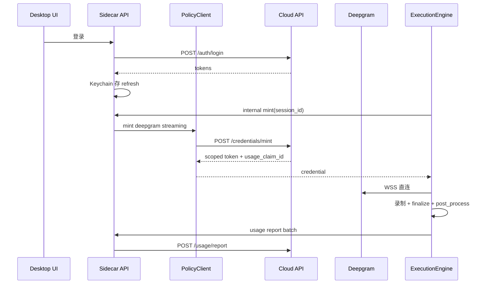

# media2text Client-Primary — 本地执行 + 云端控制面

**日期:** 2026-06-08  
**状态:** 草案（待评审）  
**前置:** [m2t-desktop](./2026-06-04-m2t-desktop-design.md)、[本地 Pipeline 重构](./2026-06-08-m2t-local-pipeline-refactor-design.md)、[Monitor Daemon v3](./2026-06-05-monitor-daemon-observe-execute-design.md)、[Live Pipeline v2](./2026-06-03-live-pipeline-v2-design.md)、[Agent 自进化](./2026-06-07-m2t-agent-self-evolution-design.md)  
**动机:** 产品化方向为 **Fat Client, Thin Cloud**：直播监控、下载、转写、摘要、Agent 蒸馏与会话均在用户本机执行；云端仅承担账号、计费、用量与第三方凭据托管。用户 **不配置、不感知** 任何第三方 API Key，客户端经云端 **Credential Broker** 获取短期凭据后 **直连** Deepgram / LLM 等服务商。

---

## 0. 已锁定决策（本 spec 范围）

| 决策项 | 选择 | 理由 |
|--------|------|------|
| 总体形态 | **Client-Primary + Cloud Control Plane** | 隐私默认本地；COGS 可控；与现有 Tauri + Python sidecar 一致 |
| 云端职责 | Auth、设备、订阅、Entitlements、Usage Ledger、**Credential Broker**、可选管理数据同步 | 不做录制/转写算力托管 |
| 客户端职责 | Monitor、录制、下载、转写、摘要、上云（用户盘）、Agent、本地 DB/媒体 | 已有 core + desktop 能力 |
| 第三方 Key | Master Key **仅存云端**；客户端 Keychain 只缓存 **短期 scoped token** | 用户零配置；泄露面可控 |
| 第三方调用路径 | 客户端 **直连** 第三方（音频/视频不过云 proxy） | 带宽与延迟；云端只 mint，不中继媒体 |
| 平台登录态 | 抖音/B站 cookie **仅存本地** `data/sessions/` | 不进云端；合规与用户预期 |
| 本地数据默认 | 媒体、转写、摘要、Agent memory **默认不上云** | 隐私叙事；可选用户自管云盘备份（已有 aliyundrive） |
| 本地 pipeline | 见 **[Execution Engine 设计](./2026-06-08-m2t-local-pipeline-refactor-design.md)**（Probe/Scheduler/Worker + R0–R4；`core/live/state_writer.py`） | 本文不展开 |
| v1 打包 | macOS Desktop 优先；CLI 仍可独立使用（降级为自带 `.env`  power user 模式） | 与 desktop spec 一致 |

未选方案（备查）：

- **全云 SaaS（Record/PostProcess Worker 上云）** — 与用户「客户端为主」冲突；COGS 高  
- **所有第三方流量经云 API Proxy** — 媒体中继成本与延迟不可接受；仅 LLM 摘要可作 fallback  
- **云端存 Master Key 下发到 `.env`** — 等同于长期密钥泄露；禁止  
- **云端托管用户抖音/B站 session** — 合规与风控复杂；defer  

---

## 1. 问题陈述

### 1.1 产品目标

从个人 CLI 演进为 **面向用户的客户端产品**，需同时满足：

1. **体验**：监控、录制、转写、摘要、Agent 在本机完成，弱网仍可监控（凭据 mint 失败时降级策略明确）。  
2. **商业化**：订阅、用量、充值在云端；按分钟/token/并发等计量。  
3. **零密钥配置**：用户不填写 Deepgram、OpenAI 等 Key；客户端透明调用。  
4. **可信**：媒体与 Agent 语料默认不出设备；云端可审计 **用量与 mint**，不可读用户转写正文（除非用户显式 opt-in 同步）。

### 1.2 现状差距

| 领域 | 现状 | 差距 |
|------|------|------|
| 凭据 | `.env` + 本地 `config.yaml` | 无 Broker；无法产品化计费 |
| 账号 | 无 | 需 Auth + 设备绑定 |
| 本地 pipeline | v2 三线程；finalize 阻塞 LiveTick | 见本地 Pipeline spec；本 spec **依赖** **R1** async finalize + **R2c** Probe/Reconciler 切流 |
| Desktop | 127.0.0.1 sidecar + WS | 需 Account/Plan UI、离线 entitlement 缓存 |
| Agent | 本地 sidecar + `summarize.llm` | LLM 调用需改走 Broker |

### 1.3 与本地 Pipeline / Monitor v3 的关系

| Spec | 职责 |
|------|------|
| **[本地 Pipeline 重构](./2026-06-08-m2t-local-pipeline-refactor-design.md)** | 本机 Execution Engine v2：**Probe / TaskScheduler / TaskReconciler / Worker**；**R1** async finalize；**R2c** 架构切流（`monitor.reconciler_enabled`）；**R3a** `pipeline_phase`；**R3b** `core/live/state_writer.py` 全量收口；**R4** `notify_events` |
| **Monitor v3** | 历史文档；Phase A 已交付；finalize 异步与观测/执行边界以本地 Pipeline spec **R1 / R2c** 为准（取代 v3 P2.3） |
| **本 spec** | **产品化控制面**：Auth、Broker、计费；不改变「任务在本机跑」 |

**依赖顺序：** 本地 Pipeline **R1 → R2a–R2c → R3a–R3b** → 本 spec Phase 1（Auth + Broker）。二者可并行开发，但 **产品 E2E 须 R2c-3 + R3a + R3b 先验收**（R4 通知 outbox 不阻塞 Broker）。

---

## 2. 目标（Success Criteria）

| ID | 指标 | 目标 | 验收 |
|----|------|------|------|
| C1 | 零 Key 配置 | 新用户登录后无需 `.env` 即可 streaming STT + 摘要（套餐允许） | 干净 profile E2E |
| C2 | 凭据安全 | 客户端磁盘/内存无 master key；仅 TTL ≤ 4h 的 scoped token | 安全审查 + 抓包 |
| C3 | 用量准确 | 转写分钟与 LLM token 与云端 ledger 误差 ≤ 5% | 对账脚本 |
| C4 | 离线 entitlement | 断网 24h 内已缓存权益可继续监控；mint 失败时 STT 可降级或排队 | 集成测试 |
| C5 | 本地 pipeline | 开播 P95 ≤ 30s；状态 UI ≤ 3s（WS）；finalize 不阻塞 observe | 同 Monitor v3 O1/O2/G1 |
| C6 | Power user | `M2T_OFFLINE=1` 或显式 `.env` 仍可跳过云端（开发/自用） | CLI flag 文档 |
| C7 | 平台 session | 抖音/B站 login 仍 `media2text auth login`；cookie 不 upload | 代码审计 |

---

## 3. 概念模型

### 3.1 两平面 + 一桥

```
┌──────────────────── Cloud Control Plane ────────────────────┐
│ Identity │ Billing │ Entitlements │ Usage │ CredentialBroker │
└────────────────────────────┬────────────────────────────────┘
                             │ HTTPS (JWT)
┌────────────────────────────▼────────────────────────────────┐
│ Client Runtime (Tauri + Python sidecar + monitor daemon)      │
│  PolicyClient ──► EntitlementCache / CredentialCache (OS KC)  │
│  ExecutionEngine ──► Observe / Record / PostProcess / Agent │
│  LocalStore ──► SQLite + data/ media                          │
└────────────────────────────┬──────────────────────────────────┘
                             │ TLS + scoped token
                    Deepgram / OpenAI-compatible / …
```

- **PolicyClient（新）**：登录、拉权益、mint 凭据、上报用量；**无业务媒体逻辑**。  
- **ExecutionEngine（现有 core 演进）**：本地 Pipeline Probe/Scheduler/Worker 语义（R2c 后 Reconciler 建任务）；状态经 **`core/live/state_writer.py`** 写入；**不 import 云端 SDK 密钥**。  
- **Credential Broker（云端）**：唯一持有 master key；签发 **不可续期 master** 的短期 token。

### 3.2 数据边界

| 数据 | 存储位置 | 同步 |
|------|----------|------|
| 账号、订阅、账单 | 云端 | — |
| Entitlements 快照 | 云端 + 客户端缓存 | 登录/周期 pull |
| Usage events | 云端 ledger；客户端 outbox 批量上报 | push |
| Mint 审计 log | 云端 | — |
| 监控博主列表 | 默认本地 DB；**可选**云端备份 | 可选 push/pull |
| 平台 cookie | 仅本地 | 不同步 |
| 直播媒体、转写、摘要 | 仅本地 | 不同步（用户 aliyundrive 除外） |
| Agent memory / distill | 仅本地 | 不同步 |
| scoped token | Keychain + 内存 | 不同步 |

---

## 4. 云端 Control Plane

### 4.1 服务划分（逻辑模块，可单体部署）

| 模块 | 职责 |
|------|------|
| **auth** | 注册、登录、refresh、设备注册、JWT 签发 |
| **billing** | 套餐、订单、充值（对接支付 defer v2） |
| **entitlements** | 按 plan 计算 limits + features |
| **usage** | 预扣、确认、对账、熔断 |
| **broker** | `POST /v1/credentials/mint` |
| **sync**（可选 P3） | 博主列表 CRUD 云备份 |

v1 可 **单 Postgres + 单 API 进程**；不必微服务化。

### 4.2 Auth & Device

**Flow：**

1. Desktop 打开 → 登录（邮箱/OAuth defer）→ `access_token`（15min）+ `refresh_token`（30d，OS Keychain）。  
2. `POST /v1/devices/register` → `device_id`（UUID，本地持久化）。  
3. 后续请求带 `Authorization: Bearer` + `X-Device-Id`。

**JWT claims（最小）：** `sub`（user_id）, `plan`, `device_id`, `exp`.

### 4.3 Entitlements

**`GET /v1/entitlements`** 返回：

```json
{
  "plan": "pro",
  "valid_until": "2026-07-08T00:00:00Z",
  "features": {
    "streaming_stt": true,
    "summarize": true,
    "agent_distill": true,
    "aliyundrive_upload": false
  },
  "limits": {
    "monitored_creators": 20,
    "concurrent_recordings": 3,
    "transcribe_minutes_month": 5000,
    "llm_tokens_month": 2000000,
    "distill_runs_month": 50
  },
  "usage": {
    "transcribe_minutes_month": 120,
    "llm_tokens_month": 45000,
    "distill_runs_month": 2
  }
}
```

客户端 **PolicyClient** 缓存至 `data/cloud/entitlements.json` + mtime；**开录 / mint 前**校验。

### 4.4 Credential Broker

**`POST /v1/credentials/mint`**

Request:

```json
{
  "service": "deepgram",
  "purpose": "live_streaming_stt",
  "session_id": "local-uuid",
  "estimated_duration_sec": 7200,
  "idempotency_key": "mint:session:local-uuid:deepgram"
}
```

Response:

```json
{
  "ok": true,
  "credential": {
    "type": "bearer",
    "token": "…",
    "expires_at": "2026-06-08T14:00:00Z",
    "endpoint": {
      "ws_url": "wss://api.deepgram.com/v1/listen?…"
    }
  },
  "usage_claim_id": "uc_01H…",
  "constraints": {
    "max_duration_sec": 7200
  }
}
```

| service | purpose | 签发策略 |
|---------|---------|----------|
| `deepgram` | `live_streaming_stt` | 按 session；TTL = min(estimated + 15min, 4h) |
| `deepgram` | `batch_transcribe` | 按 job；TTL 1h |
| `openai_compatible` | `summarize` | 按 job；可含 max_tokens 上限 |
| `openai_compatible` | `agent_turn` | 按 turn；短 TTL 30min |

**服务端逻辑：**

1. 校验 JWT + entitlement + 余量  
2. **预扣** usage（可配置为 mint 时扣 estimated，完成后 reconcile）  
3. 用 master key 向服务商创建 **scoped token**（或等价：Deepgram 项目 key 轮换 + 限制）  
4. 写 `credential_mints` 审计行  

**错误码：**

| HTTP | code | 客户端行为 |
|------|------|------------|
| 402 | `quota_exceeded` | 停 STT/LLM；UI 引导升级 |
| 403 | `feature_disabled` | 功能不可用 |
| 429 | `rate_limited` | 退避重试 |
| 401 | `auth_expired` | 刷新 token 或重新登录 |

### 4.5 Usage Ledger

**客户端上报 `POST /v1/usage/report`（批量，可离线队列）：**

```json
{
  "events": [
    {
      "usage_claim_id": "uc_01H…",
      "kind": "transcribe_audio_sec",
      "quantity": 3842,
      "session_id": "local-uuid",
      "recorded_at": "2026-06-08T12:00:00Z"
    },
    {
      "usage_claim_id": "uc_02H…",
      "kind": "llm_tokens",
      "quantity": 1523,
      "metadata": { "purpose": "summarize" }
    }
  ]
}
```

云端 reconcile：预扣 vs 实际 → 退还或补扣。

**防作弊（v1 基线）：** mint 绑定 `user_id + device_id`；单设备并发 mint 上限；异常模式人工 review。**不做**客户端 attestation hardening（defer）。

### 4.6 可选：管理数据 Sync（Phase 3）

**`PUT /v1/sync/creators`** — 仅 `{ id, platform, url, monitor_enabled, auto_record_override }[]`；**不含** sec_uid 敏感字段若用户不愿上传则可 hash。

冲突：LWW + Desktop 提示「云端版本更新」。

---

## 5. 客户端架构

### 5.1 模块图

```
apps/m2t-desktop (Tauri)
  └─ src/ … UI, Account/Plan 页
Python sidecar (media2text.api)
  ├─ PolicyClient          # 新：auth / entitlements / mint / usage outbox
  ├─ CredentialProvider    # 新：统一接口替代 os.environ DEEPGRAM_*
  ├─ MonitorSupervisor     # 已有
  ├─ ExecutionEngine       # Probe / TaskScheduler / Worker（本地 Pipeline R2c）
  ├─ StateWriter           # core/live/state_writer.py（R2c 最小；R3b 全量）
  ├─ ProjectionService     # pipeline_phase → API/WS（R3a）
  └─ desktop_events drain  # 已有；R4 扩展 notify_events
Local daemon (monitor watch --daemon)
  └─ 同进程或 sidecar spawn；共享 PolicyClient 实例（HTTP 调 sidecar /v1/internal/…）
```

**约束：** `media2text.core` **禁止**硬编码 cloud URL；通过 `PolicyClient` 注入或 `config.cloud.base_url`。

### 5.2 CredentialProvider（core 抽象）

```python
class CredentialProvider(Protocol):
    def get(self, service: str, purpose: str, *, session_id: str | None = None, **kwargs) -> Credential: ...

class EnvCredentialProvider: ...       # 现有 .env，power user
class BrokerCredentialProvider: ...    # 调 sidecar → cloud mint
class CachedCredentialProvider: ...    # Keychain + TTL 刷新
```

**注入点（须改）：**

| 现模块 | 变更 |
|--------|------|
| `streaming_stt.py` | WS 连接前 `provider.get("deepgram", "live_streaming_stt", session_id=…)` |
| `transcribe/*` | batch 转写 mint |
| `summarize/*` | LLM client base_url + api_key 来自 mint |
| Agent sidecar env | `media2text serve` 启动 Agent 前注入 **短期** LLM 凭据，非 master |

### 5.3 PolicyClient 本地持久化

| 路径 | 内容 |
|------|------|
| OS Keychain | refresh_token |
| `data/cloud/entitlements.json` | 权益缓存 |
| `data/cloud/usage_outbox.jsonl` | 待上报用量（append-only） |
| `data/cloud/device_id` | 设备 UUID |

**离线：** entitlements 在 `valid_until` 内可用；mint 需联网，失败则 streaming 降级 legacy 或暂停 STT（配置 `live.stt_offline_behavior: pause|legacy|skip`）。

### 5.4 本地 ExecutionEngine

线程模型、**R2c**（`reconciler_enabled`、Probe 零 enqueue）、**StateWriter**（`core/live/state_writer.py`）、`pipeline_phase`（R3a）、`notify_events`（R4）、Desktop 契约见 **[本地 Pipeline 重构 spec](./2026-06-08-m2t-local-pipeline-refactor-design.md)**。

**与 Broker 的边界：** StateWriter / ExecutionEngine **不**经云端；仅 STT/LLM **调用前**走 CredentialProvider。daemon 与 sidecar 共享 loopback API，**不**共享 SQLite connection（每线程 `open_db`，见本地 spec I.6）。

本 spec 仅追加 **凭据门控**（Phase 1 起）：

- **开录前：** `entitlements.check(concurrent_recordings)` + 可选 `monitored_creators` 计数  
- **STT 启动前：** `CredentialProvider.get`；402 → `transcribe_status=quota_exceeded`  
- **post_process 完成：** `usage.report`（Phase 2）  

---

## 6. API 契约摘要

### 6.1 云端 Public API（v1）

| Method | Path | 说明 |
|--------|------|------|
| POST | `/v1/auth/register` | defer OAuth 时可仅 passwordless |
| POST | `/v1/auth/login` | 返回 tokens |
| POST | `/v1/auth/refresh` | |
| POST | `/v1/devices/register` | |
| GET | `/v1/entitlements` | |
| POST | `/v1/credentials/mint` | |
| POST | `/v1/usage/report` | |
| GET | `/v1/billing/plan` | 可选 P2 |

### 6.2 本地 Sidecar API（扩展）

| Method | Path | 说明 |
|--------|------|------|
| GET | `/api/account/status` | 登录态、plan、余量摘要 |
| POST | `/api/account/login` | 代理云端 login，写 Keychain |
| POST | `/api/account/logout` | |
| POST | `/api/internal/credentials/mint` | daemon 调 sidecar 统一 mint |
| GET | `/api/creators` | 已有；增加 `pipeline_phase` |
| GET | `/api/runtime` | 已有；增加 `cloud: { connected, entitlements_stale }` |

Sidecar 持 refresh token；daemon **不**直接持账号 token，经 loopback internal API。

---

## 7. 安全与隐私

| 项 | 要求 |
|----|------|
| Master Key | 仅云端 KMS/环境变量；不进 repo |
| Scoped token | TTL ≤ 4h；绑定 usage_claim_id |
| 传输 | TLS 1.2+；certificate pinning defer |
| 本地 | refresh token 仅 Keychain；不进 `data/` 明文 |
| 日志 | 禁止 log 完整 token；仅前后 4 字符 |
| 平台 cookie | 不上传；用户设备本地加密 at rest defer |
| 合规 | 隐私政策声明：用量/metadata 上传；媒体默认不上传 |

**LLM Proxy Fallback（可选）：** 若服务商不支持 scoped token，摘要类请求可走 `POST /v1/proxy/openai/chat/completions`（云端加 key）；**音频类永不 proxy**。

---

## 8. 分阶段交付

### Phase 0 — 本地 pipeline（阻塞项）

**权威 spec：** [2026-06-08-m2t-local-pipeline-refactor-design.md](./2026-06-08-m2t-local-pipeline-refactor-design.md)

| 本地 R 阶段 | 内容 | 阻塞 Client-Primary |
|-------------|------|---------------------|
| R0 | pytest 基线 | 否 |
| **R1** | async finalize（去掉 LiveTick `drain_priority_zero` sync） | **是** — C5 稳定性 |
| **R2a** | `TaskSchedulerThread`；drain 迁出 LiveTick/SlowTick；每线程 conn | **是** — G5 |
| **R2b** | LW-01..04 handler；`recording.py` 按 handler 抽 | **是** — R2c 前置 |
| **R2c** | `TaskReconciler` + Probe 纯传感；2–3 PR + `reconciler_enabled`；StateWriter 最小集 | **是** — C5 架构 |
| **R3a** | `pipeline_phase` + API/Desktop | **是** — C5 状态 UI ≤3s |
| **R3b** | StateWriter 全量（`core/live/state_writer.py`）；禁 direct repo | **是** — 产品 E2E 前必验收 |
| R4 | `notify_events` + `outbox_only` | 否（体验增强；飞书/声音） |

Epic 外（本地 spec）：download/transcribe 拆分 — **不**阻塞本 spec。

**出口：** **R2c-3**（`reconciler_enabled` 默认 true）+ **R3a** + **R3b** 完成 → 无账号也能稳定监控；再启动 Phase 1 Auth/Broker。

### Phase 1 — Cloud MVP + Broker

- [ ] 云端：auth + devices + entitlements（静态 plan 表即可）  
- [ ] 云端：broker mint（Deepgram + 1 个 OpenAI 兼容 LLM）  
- [ ] 客户端：`PolicyClient` + `BrokerCredentialProvider` + Account UI 登录  
- [ ] streaming STT + summarize 改 CredentialProvider  
- [ ] `M2T_USE_BROKER=1` feature flag；默认 off 直至 Phase 1 验收  

**出口：** C1/C2 对 Deepgram + 摘要成立。

### Phase 2 — 用量与商业化

- [ ] Usage ledger + 预扣/reconcile  
- [ ] usage outbox + 离线补报  
- [ ] 402/quota UI；limits 门控开录与 mint  
- [ ] 套餐页（只读 plan + 用量条）  

**出口：** C3/C4。

### Phase 3 — 体验与可选同步

- [ ] 博主列表云同步（opt-in）  
- [ ] Desktop 15s HTTP 兜底轮询 creators  
- [ ] Agent turn 全面 Broker 化 + distill 用量  
- [ ] LLM proxy fallback（若需要）  

### Phase 4 — 加固

- [ ] 设备数上限、异常 mint 熔断  
- [ ] 支付接入  
- [ ] Windows/Linux 打包 + Keychain 等价物  

---

## 9. 与现有配置迁移

| 现配置 | 产品模式 | Power user |
|--------|----------|------------|
| `.env` `DEEPGRAM_API_KEY` | 废弃（Broker） | 保留 `EnvCredentialProvider` |
| `.env` `NVIDIA_API_KEY` / summarize | Broker mint | 保留 |
| `config.yaml` `summarize.llm` | 仅 model/id；key 来自 Broker | 可覆盖 base_url+key |
| `config.yaml` `live.*` | 不变 | 不变 |
| `auth login --platform douyin` | 不变，本地 | 不变 |

**检测逻辑：** 若 Keychain 有 refresh_token → `BrokerCredentialProvider`；否则若 `.env` 有 key → `EnvCredentialProvider`；否则 STT/LLM 功能禁用并 UI 提示登录。

---

## 10. 测试策略

| 层 | 内容 |
|----|------|
| 云端单元 | entitlements 计算、mint 幂等、quota 402 |
| 云端集成 | mock Deepgram admin API → mint → 客户端可用 |
| 客户端单元 | CredentialProvider 缓存/TTL/刷新 |
| 客户端集成 | 登录 → mint → mock WS STT → usage report |
| E2E | Desktop 登录 → 监控 → 录一场 → 摘要；ledger 对账 |
| 回归 | `M2T_USE_BROKER=0` + `.env` 全绿 |

---

## 11. 非目标（本 spec）

- 云端录制、云端对象存储托管用户视频  
- 云端 Agent 推理与 memory 托管  
- 抖音/B站 平台 session 云同步  
- 多租户团队/组织 RBAC（defer）  
- 支付渠道具体接入（Phase 4）  
- Temporal / 独立 Workflow 服务（本地 SQLite 队列足够）  

---

## 12. 开放项（评审时锁定）

| # | 问题 | 选项 | 建议 |
|---|------|------|------|
| O1 | mint 预扣策略 | A  mint 扣 estimated / B 仅 report 后扣 | **A** 防滥用；report reconcile |
| O2 | 无网 STT | A pause / B legacy 本地 whisper / C 停录 | **A** 默认；B 为 Pro 可选 |
| O3 | CLI 产品化 | A 强制登录 / B CLI 永可 `.env` | **B** Desktop 强制 Broker |
| O4 | 云端部署 | A 自建单体 / B serverless | **A** MVP |
| O5 | Agent LLM | A 每 turn mint / B session 级 30min token | **B** 减 mint 频率 |

---

## 13. 参考架构图（目标态）



---

## 14. 文档与后续

- Implementation plan：`docs/superpowers/plans/2026-06-08-m2t-client-primary-control-plane.md`（评审通过后由 writing-plans 产出）  
- Issue 编排：`docs/issues/` 下按 Phase 0–2 拆 Epic  
- 与本地 Pipeline R 阶段：**Phase 0 共用 issue 优先级**（R1 → R2a → R2b → R2c → R3a → R3b），避免双线冲突  

---

**请评审：** 边界是否与你「客户端为主、云端管 Key 和钱」一致；开放项 O1–O5 确认后可进入 implementation plan。
