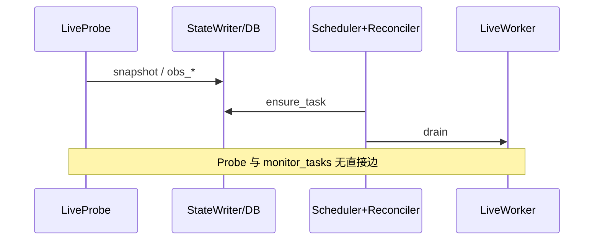

# 本地 Execution Engine — 目标架构与重构路径

**日期:** 2026-06-09  
**状态:** 草案（Eng Review 2026-06-08，决策已锁）  
**取代:** [Monitor Daemon v3](./2026-06-05-monitor-daemon-observe-execute-design.md)  
**前置:** [Live Pipeline v2](./2026-06-03-live-pipeline-v2-design.md)、[m2t-desktop](./2026-06-04-m2t-desktop-design.md)  
**被依赖:** [Client-Primary 控制面](./2026-06-08-m2t-client-primary-control-plane-design.md)

---

# Part I — 目标架构

```
Probe (Sense)     → StateWriter → DB 观测态
TaskScheduler     → TaskReconciler.read(DB) → ensure_task → monitor_tasks
TaskScheduler     → claim → WorkerPool.submit
Worker            → 执行 + SessionRuntime → StateWriter + EventPublisher
```

**硬约束（`monitor.reconciler_enabled: true` 时）：** 任务 **仅** TaskReconciler 创建（`ensure_task`）。Probe **永不** touch `monitor_tasks`。**禁止** Probe enqueue 与 Reconciler ensure 并存。

**迁移窗口：** `reconciler_enabled: false` 时允许 legacy enqueue 路径（仅用于 R2c 分 PR 切流，≤1 release）；flag 默认 `true` 后 enforce 上述硬约束。

## I.0 已锁定决策

| 项 | 选择 |
|----|------|
| 三层 | 传感（Probe）/ 编排（Reconcile + Drain）/ 执行（Worker） |
| Probe | 纯传感 — LP-01/02/03 + CP clock；禁止 enqueue / if-else / subprocess |
| Scheduler | 每 tick：reconcile → drain；`ensure_task` 幂等；**纯 1s tick**（无 Probe wakeup） |
| 开录 | LW-01 `prepare_live_recording`（p1）；snapshot 有 stream_url 则 Worker 内直 spawn |
| 队列 | `monitor_tasks`（live p0–7 + content p10+）∥ `post_process_jobs` |
| 状态 | `core/live/state_writer.py` 单写口；`pipeline_phase` 投影 |
| 连接 | 每线程 `open_db()`；禁止共享 `watcher._conn` 跨线程写 |
| 观测列 | 新增 `obs_*` 四列；`offline_since_at` 与 obs 双写（见 I.4） |
| finalize 取消 | `MonitorTaskRepo.cancel_pending(dedupe_key=...)`；running 不可 cancel |
| R2c 切流 | 2–3 PR + `monitor.reconciler_enabled` flag |
| 提醒 | 全部 `notify_events`（R4 `outbox_only: true`） |
| Guard | `ProbeExecutionGuard`：单测 monkeypatch + 生产 tick 末 assert/log |

## I.1 原则

1. Probe 只写 snapshot / `obs_*` / poll clock / offline 语义（经 StateWriter，含 `offline_since_at` 双写）。
2. 全部 RR-* / RC-* 在 Scheduler；Worker 只做 T2+。
3. Sidecar（ffmpeg、STT）仅 Worker 启停；Probe 只写 `obs_*_alive`。
4. Notify / WS 经 outbox drain，Worker 不 sync emit。
5. DB 写路径经 StateWriter；Probe / Scheduler / Worker 各持独立 connection（见 I.6）。

---

## I.2 任务目录（权威）

### Probe（T0，只写 State）

| ID | 动作 | 产出 |
|----|------|------|
| LP-01 | `probe_live` | snapshot |
| LP-02 | `poll_active_session` | `obs_*` + offline 双写（I.4） |
| LP-03 | `mark_stale_sessions_failed` | session `failed` |
| CP-01–03 | content clock tick | `*_due`、`last_*_poll_at` |

### Scheduler（T0）

每 tick：`reconcile_live` → `reconcile_content` → drain live（**p0 min 1**）→ post_process → content。

**Live task_type（monitor_tasks）：**

| p | type | Handler |
|---|------|---------|
| 0 | `finalize` | LW-05 |
| 1 | `prepare_live_recording` | LW-01 |
| 5 | `start_streaming_stt` | LW-02 |
| 6 | `reconnect_recording` | LW-03 |
| 7 | `reconnect_streaming_stt` | LW-04 |

Content：p10+ `sync_catalog` / `sync_dynamic` / `download` / `pipeline_run`（已有）。

### Reconcile 规则

| ID | 条件 | ensure | dedupe_key |
|----|------|--------|------------|
| RR-01 | `is_live` + auto_record + 无 active session | prepare p1 | `prepare:{creator_id}` |
| RR-02 | `offline_since_at` 满 confirm | finalize p0 | `finalize:{session_id}` |
| RR-03 | recording + `obs_ffmpeg_alive=false` + still live | reconnect p6 | `reconnect_rec:{session_id}` |
| RR-04 | streaming + `obs_stt_alive=false` + ffmpeg 活 | reconnect STT p7 | `reconnect_stt:{session_id}` |
| RR-05 | streaming + ffmpeg 活 + STT 未 streaming + 无 pending start | start STT p5 | `start_stt:{session_id}` |
| RC-01–03 | `vod_due` / `archive_due` / `dynamic_due` | sync_* p10+ | `sync_*:{creator_id}` |

**offline 恢复（RR-02 逆操作）：** `obs_still_live=true` 且存在 pending `finalize:{session_id}` → `MonitorTaskRepo.cancel_pending(dedupe_key=...)`。`status=running` 的 finalize **不** cancel。

`ensure_task`：同 dedupe_key 已有 pending/running → no-op（不替代 cancel）。

### Worker + SessionRuntime

| ID | 职责 |
|----|------|
| LW-01 | resolve（如需）+ spawn FLV；StateWriter |
| LW-02 / LW-04 | STT start / reconnect → SR-02 |
| LW-03 | ffmpeg reconnect → SR-01 |
| LW-05 | stop sidecar；legacy remux；enqueue post_process |
| SR-01/02 | T4 sidecar（Worker 生命周期内） |

### 时序（streaming）



---

## I.3 Probe 配置

| 配置 | 默认 |
|------|------|
| `probe_tick_budget_sec` | `2 × live_poll_interval_sec` |
| `probe_http_timeout_sec` | `5` |
| `probe_parallelism` | `live.scan_concurrency`（4） |

### ProbeExecutionGuard（R2c）

**目标：** Probe 线程不得调用 subprocess / `MonitorTaskRepo.enqueue` / `ensure_task`。

**实现（Eng Review D7）：**

| 层 | 行为 |
|----|------|
| 单测 / 集成 | monkeypatch `MonitorTaskRepo.enqueue`、`subprocess.Popen` 等；Probe tick 内调用 → assert fail |
| 生产 | 敏感 API 入口 `ProbeGuard.record_violation()`；Probe tick 末 `assert not violated`（dev）或 log + metric（prod） |
| Hook 点 | `MonitorTaskRepo.enqueue`、`ensure_task`、`subprocess.Popen`、`LiveRecordingCore._start_recording` |

`test_probe_never_enqueues` 为 R2c 合并闸门。

---

## I.4 State 与 Event

**Session 观测列（LP-02 写，Reconciler 读）：** `obs_ffmpeg_alive`、`obs_stt_alive`、`obs_still_live`、`obs_polled_at`。

**`offline_since_at` 与 obs 双写（Eng Review D4）：**

| 字段 | 写入方 | 读者 |
|------|--------|------|
| `obs_still_live` | LP-02（StateWriter） | RR-03/04/05 |
| `offline_since_at` | LP-02 首次 offline（StateWriter） | RR-02、Desktop 黄灯、`status_lights` |
| `obs_polled_at` | LP-02 | 新鲜度 / 调试 |

规则：LP-02 **禁止** direct `LiveSessionRepo.set_offline_since`；统一 `StateWriter.set_offline_since(session_id, iso)`，内部同事务写 `offline_since_at` + 更新 `obs_still_live=false` + 必要时 `desktop_events` / `live_ended`（R2c 前可仍 inline emit，R4 改 outbox）。

offline 恢复：`StateWriter.clear_offline_since` 清 `offline_since_at` + `obs_still_live=true`；Scheduler reconcile 触发 `cancel_pending(finalize:...)`.

**StateWriter（`core/live/state_writer.py`；R2c 最小集，R3b 全量）：**

- R2c：`update_snapshot`、`set_offline_since` / `clear_offline_since`、`write_obs`、`enqueue_desktop_event`；`live_ended` 通知链。
- R3b：其余 session/job 路径；禁止 Probe/Worker direct repo（CI grep）。

**pipeline_phase（R3a）：** `offline` → `live_unrecorded` → `recording` / `recording_stt_pending` → `offline_pending` → `finalizing` → `post_processing` → `completed` | `failed`

**Outbox：** `desktop_events`（WS）+ `notify_events`（飞书/声音）；R4 DDL 见附录 A。

---

## I.5 成功指标

| ID | 目标 |
|----|------|
| G1 | Probe ≤ budget；零 enqueue/subprocess/任务逻辑 |
| G1′ | reconcile→LW-01→spawn P95 ≤30s（含 1s tick 等待；`live_pipeline_events` 分段计时验收） |
| G3/G4 | offline→`live_ended`；confirm+finalize ≤60s |
| G5 | Content/PostProcess 不拖 Probe |
| L6 | notify 全 outbox（R4） |

---

## I.6 连接与事务（Eng Review D2）

```
LiveProbeThread    ──open_db()──┐
TaskSchedulerThread ──open_db()──┼──► StateWriter ──► SQLite (WAL)
Worker (per task)   ──open_db()──┘
```

| 规则 | 说明 |
|------|------|
| 每线程独立 connection | 与 `PostProcessExecutor`「每 job `open_db`」一致 |
| 禁止 | `MonitorWatcher._conn` 跨线程读写（R2a 起 deprecate；R3b grep） |
| StateWriter | 唯一业务写 API；reconcile + `ensure_task` + outbox 可 `BEGIN IMMEDIATE` 同事务 |
| 读路径 | Reconciler 只读当前 connection snapshot；不依赖未提交写 |

`test_conn_per_thread_no_shared_watcher_conn`（R2a 闸门）：Probe + Scheduler 并行 tick 无 `database is locked` 间歇失败。

---

# Part II — 迁移

## II.1 现状缺口（`main`）

| 代码现状 | 目标 |
|----------|------|
| `LiveTick.drain_priority_zero` sync | Scheduler drain + LW-05 |
| `run_once` scan_and_start 一体 | LP-01 + RR-01 → LW-01 |
| `poll_active` sync 重连 + enqueue finalize + `_emit_live_ended` | LP-02 obs + RR + StateWriter |
| SlowTick enqueue content + drain | CP clock + RC + Scheduler drain |
| `monitor_executor` 无 prepare/reconnect/STT task | R2b 新增 4 个 handler |
| `MonitorWatcher._conn` 共享 | 每线程 `open_db` + StateWriter |

**复用：** `observe_live_state`、`monitor_tasks`、`PostProcessExecutor.submit`、`desktop_events`、`offline_since_at`。

## II.2 切流原则

1. **顺序固定：** R1 → R2a → R2b → **R2c（分 PR 切流）** → R3a/R3b → R4。
2. **双路径窗口：** 仅当 `monitor.reconciler_enabled: false` 时允许 legacy Probe enqueue；**禁止** 同一运行实例 flag=true 时仍走 enqueue。R2c 拆 2–3 PR，**≤1 release** 后默认 `true` 并删除 legacy 路径。
3. **R2c 前置：** R2a（Scheduler drain）+ R2b（Live Worker 四类 task 可调度）必须已合并。
4. **R2c-PR3 合并条件：** `test_probe_never_enqueues` + E2E 绿 → 默认 `reconciler_enabled: true`。

## II.3 阶段

| 阶段 | 目标 | 交付 | 验收 |
|------|------|------|------|
| **R0** | 基线 | — | pytest 绿 |
| **R1** | G5 止血 | 删 `drain_priority_zero` sync；finalize 仅 async drain | `test_live_tick_not_blocked_by_slow_finalize` |
| **R2a** | Scheduler 壳 | `TaskSchedulerThread`；live/post/content drain 迁出 LiveTick/SlowTick；p0 min claim；probe budget/并行；每线程 conn | tick 不跑 remux；`test_conn_per_thread_*` |
| **R2b** | Live Worker 任务化 | `monitor_executor` + LW-01..04；`recording.py` 按 handler 边界抽；`run_once` → observe + poll 拆分 | `test_prepare_live_recording_task`、`test_reconnect_*_task` |
| **R2c** | **架构切流** | 见 II.4（2–3 PR）；`obs_*`；Reconciler；Probe 纯传感；Guard；StateWriter 最小集 | `test_probe_never_enqueues`、`test_scheduler_reconcile_*`、`test_offline_flash_recovery`、E2E |
| **R3a** | 可读 UI | `pipeline_phase` + API/Desktop | `test_pipeline_phase_*` |
| **R3b** | State 收口 | StateWriter 全量；CI grep 禁 direct repo | `test_no_direct_repo_outside_state_writer` |
| **R4** | Notify outbox | `notify_events`；删 inline emit；`outbox_only: true` | `test_notify_outbox_only` |

**Epic 外（非阻塞 v4）：** download/transcribe 拆分、heartbeat 扩展 — 不单独立 R 阶段。

## II.4 R2c 分 PR 切流（Eng Review D1）

**非单 PR。** 推荐顺序：

| PR | 内容 | flag |
|----|------|------|
| **R2c-1** | Schema `obs_*`；`task_reconciler.py` + `cancel_pending`；StateWriter 最小集；`reconciler_enabled` 默认 `false` | legacy enqueue 仍可用 |
| **R2c-2** | LP-02 纯 obs + 双写；删 `poll_active` sync 重连/enqueue/inline emit；`platform/*/live` 仅 observe；SlowTick 只写 `*_due`；ProbeExecutionGuard | flag=false 时 Reconciler 影子跑（log-only 可选） |
| **R2c-3** | 删 legacy enqueue；默认 `reconciler_enabled: true`；`LiveTickLoop` → `LiveProbeThread`（可选） | enforce 硬约束 |

清单（跨 PR）：

1. Migration：附录 A `obs_*` 列。
2. `MonitorTaskRepo.cancel_pending(dedupe_key)` — pending only。
3. Scheduler tick 先 reconcile（flag=true 时 ensure；false 时仅 legacy）。
4. `poll_active_session`：只写 obs + offline（StateWriter）。
5. `platform/*/live.run_once`：`observe_live_state` + `poll_active_session`；删 `scan_and_start`（R2c-3）。
6. SlowTick / watcher：content 只写 `*_due`；删 enqueue（R2c-2/3）。
7. 启用 ProbeExecutionGuard（R2c-2）。

## II.5 文件地图

| 文件 | 阶段 |
|------|------|
| `core/live/scheduler.py` | R1；R2a +TaskScheduler；R2c LiveProbe |
| `core/live/task_scheduler.py` | R2a |
| `core/live/task_reconciler.py` | R2c |
| `core/live/state_writer.py` | R2c 最小；R3b 全量 |
| `core/live/monitor_executor.py` | R2b handlers；R4 EventPublisher |
| `core/live/recording.py` | R2b 抽逻辑；R2c 纯 poll；R3b 经 StateWriter |
| `core/live/probe_guard.py` | R2c |
| `core/monitor/watcher.py` | R2c ContentProbe；deprecate 共享 conn |
| `platform/*/live.py` | R2c |
| `core/live/pipeline_phase.py` | R3a |
| `core/notify/outbox.py`、`api/.../notify_event_drain.py` | R4 |

## II.6 风险

| 风险 | 缓解 |
|------|------|
| R1 后 finalize 排队 | R2a p0 min claim |
| R2c 回归面大 | R2b handler 单测；2–3 PR + flag 回退 |
| 开录 +1–2s（1s reconcile） | G1′ 用 `live_pipeline_events` 验收；接受 D3 决策 |
| `offline_since_at` / obs 分叉 | I.4 双写规则 + StateWriter 单口 |
| 闪断误 finalize | `cancel_pending` + `test_offline_flash_recovery` |
| 多博主 worker 串行 | `live_worker_max_parallel` 可按 CPU 调大（默认 1） |

---

# 附录

### A. Schema

**R2c — session 观测列：**

```sql
ALTER TABLE live_sessions ADD COLUMN obs_ffmpeg_alive INTEGER;
ALTER TABLE live_sessions ADD COLUMN obs_stt_alive INTEGER;
ALTER TABLE live_sessions ADD COLUMN obs_still_live INTEGER;
ALTER TABLE live_sessions ADD COLUMN obs_polled_at TEXT;
-- offline_since_at 已存在；LP-02 经 StateWriter 双写，不新增 obs_offline 列
```

**R2c — task cancel（repo 层，无 DDL）：**

```python
# MonitorTaskRepo.cancel_pending(dedupe_key: str) -> int
# UPDATE monitor_tasks SET status='cancelled'
# WHERE dedupe_key=? AND status='pending'
```

**R4 — notify outbox：**

```sql
CREATE TABLE IF NOT EXISTS notify_events (
  id TEXT PRIMARY KEY,
  kind TEXT NOT NULL,
  dedupe_key TEXT,
  creator_id TEXT,
  session_id TEXT,
  payload_json TEXT NOT NULL,
  created_at TEXT NOT NULL,
  delivered_at TEXT
);
CREATE UNIQUE INDEX IF NOT EXISTS idx_notify_events_dedupe_active
  ON notify_events(dedupe_key) WHERE delivered_at IS NULL AND dedupe_key IS NOT NULL;
```

### B. 配置

```yaml
monitor:
  scheduler_interval_sec: 1
  reconciler_enabled: false       # R2c-3 起默认 true；true 时 enforce Probe 零 enqueue
  live_worker_max_parallel: 1     # 多博主可酌情调大
  live_lane_min_claim_per_tick: 1
  probe_tick_budget_sec: 0          # 0 = 2 × live_poll_interval_sec
  probe_parallelism: 4
notify:
  outbox_only: true                 # R4 起强制
```

### C. 测试闸门（按阶段）

| 阶段 | 测试 |
|------|------|
| R1 | `test_live_tick_not_blocked_by_slow_finalize` |
| R2a | Scheduler drain 不阻塞 live tick；`test_conn_per_thread_no_shared_watcher_conn` |
| R2b | `test_prepare_live_recording_task`、`test_reconnect_*_task` |
| R2c | `test_probe_never_enqueues`、`test_scheduler_reconcile_prepare|finalize|reconnect`、`test_live_ended_via_state_writer_only`、`test_offline_flash_recovery`、`test_poll_active_writes_obs_only` |
| R3a | `test_pipeline_phase_*` |
| R3b | grep 禁 Probe direct repo |
| R4 | `test_notify_outbox_only` |
| E2E | is_live → prepare → STT → offline → finalize → notify drained |

### D. 非目标

云端 Broker、Redis/Temporal、asyncio 重写、四色灯语义替换、download/transcribe 拆分（Epic 外）、**`reconciler_enabled=false` 长期共存**（仅 R2c 迁移窗口，≤1 release）。

### E. 文档关系

[Live Pipeline v2](./2026-06-03-live-pipeline-v2-design.md) · [Monitor Daemon v3](./2026-06-05-monitor-daemon-observe-execute-design.md) · [Client-Primary](./2026-06-08-m2t-client-primary-control-plane-design.md)

---

## GSTACK REVIEW REPORT

| Review | Trigger | Runs | Status | Findings |
|--------|---------|------|--------|----------|
| Eng Review | `/plan-eng-review` | 1 | CLEAR (PLAN) | D1–D7 已锁：分 PR+flag、每线程 conn、1s reconcile、obs 四列+双写、cancel_pending、state_writer@live、Guard |

- **UNRESOLVED:** 0
- **VERDICT:** ENG CLEARED — spec 已合入 2026-06-08 决策，可拆 issue 实施
