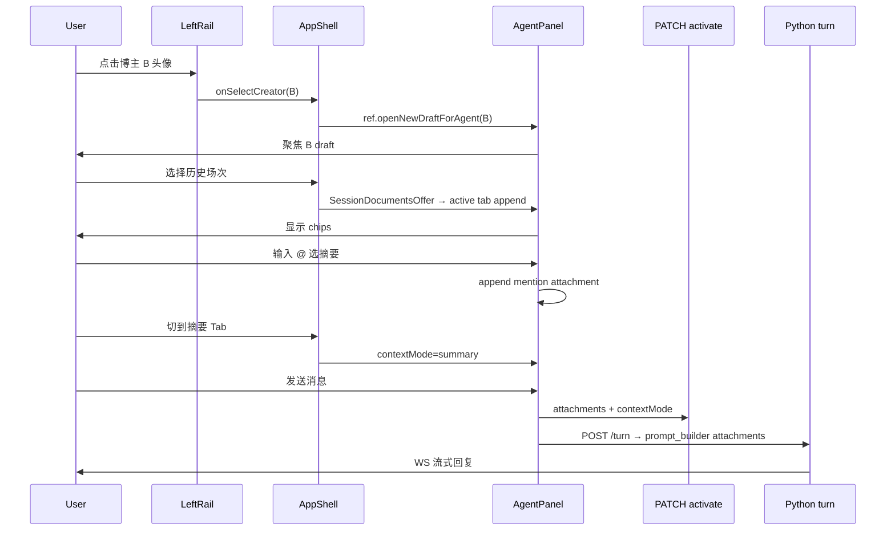

# m2t-desktop — Agent 身份联动与多文档上下文

**日期:** 2026-06-09  
**状态:** 已批准（待实现）  
**前置:** [Agent 区块与桌面分区布局](./2026-06-06-m2t-desktop-agent-pane-design.md)、[Agent 面板 UI 细化](./2026-06-07-m2t-desktop-agent-pane-ui-refinements-design.md)、[UI 设计系统](./2026-06-04-m2t-desktop-ui-design.md)  
**本文性质:** 对 `2026-06-06` / `2026-06-07` Agent 规格的 **增量修订**；承接 UI 细化 §0.2「附件 / @ 引用真实能力」非目标项。

---

## 0. 背景与范围

### 0.1 动机

桌面端 Agent 已具备：按 Agent 身份（灵犀 + 各博主）的 draft/thread 模型、场次 → `context.refresh` 的 path 转发、Composer 占位符 `@ 引用文件`。用户仍缺少三条关键链路：

1. **左栏选博主 ↔ Agent 身份** — 点头像后应自动进入该博主的 **新 draft 会话**，而非仅影响 `+` 与首次空页签。
2. **场次 ↔ 可见上下文** — 选中直播/作品后应 **默认附加** 转写/摘要，并在 Composer **上方展示 chip**，可逐项取消。
3. **`@` 跨博主引用** — 输入 `@` 从历史文档中选 **转写或摘要**（分行），与场次默认附加 **累加** 而非替换。

视觉参考：DeepSeek 等产品的「输入框上方附件卡片 + × 移除」。

### 0.2 已锁定产品决策（2026-06-09）

| ID | 问题 | 决策 |
|----|------|------|
| D1 | 点左栏博主后 Agent 行为 | **自动聚焦新的 draft 页签**（`agentId` = 该博主） |
| D2 | 取消 chip 后 session 绑定 | **保留 `sessionId`**；仅移除对应文档 path |
| D3 | `contextMode` | **仍随转写区 Tab**（转写 / 摘要）自动切换 |
| D4 | 场次默认附加 vs `@` | **累加多文档**；同 path 去重 |
| D5 | `@` 列表粒度 | **转写、摘要各一条**（同场次最多 2 个可选项） |

### 0.4 已锁定工程决策（2026-06-09，`/plan-eng-review`）

| ID | 问题 | 决策 |
|----|------|------|
| E1 | 分期：chip vs binding/API | **P1a 与 P2a 合并**为同一里程碑（chip UI + binding + activate + prompt 同批交付）；单独 chip 不算 D4 完成 |
| E2 | Turn 上下文注入路径 | **Python `prompt_builder` 必做**（`/api/agent/threads/{id}/turn`）；sidecar `context.ts` 次要/过渡同步 |
| E3 | attachments 状态作用域 | **按 active `tabEntryKey`（per-tab）**；AppShell 只广播「当前场次可用文档」，不持有 attachments 数组 |
| E4 | 左栏 → Agent 桥接 | **`AgentPanel` ref callback**（`openNewDraftForAgent`）；不用全局 event bus |
| E5 | activate 失败 | **`useM2tAgent` PATCH 失败 toast**（可选手动重试）；禁止 `.catch(() => {})` 静默 |
| E6 | `@` sessions 拉取 | **按需 lazy + 并发上限 3 + per-creator 内存缓存（~5min）**；不全量 N 博主并发 |

### 0.3 范围

| 在范围内 | 不在范围内 |
|----------|------------|
| 左栏 `onSelectCreator` → Agent draft 联动 | 页签拖拽排序 |
| Composer 上方 attachment chips UI | 附件二进制上传（非 workspace 侧car 文件） |
| `@` popover + 跨博主 sessions 索引 | v1 服务端全文搜索 API（可 P2 加 `GET /api/agent/context-documents`） |
| `contextMode` ← `TranscriptPane` tab | B 站 archive/dynamic 进 `@` 列表（P2，同 agent-pane §14.5） |
| `attachments[]` binding + activate + sidecar | 点赞/点踩、消息编辑 |
| draft 态 attachments 内存态 → 首条发送持久化 | 附件数量硬上限（v1 仅 UI 全展示 + turn 侧截断提示） |

---

## 1. 相对既有规格的修订

| 项 | 旧（2026-06-06 / 07） | **新（本文）** |
|----|------------------------|----------------|
| 左栏选博主 → Agent | 仅 `defaultAgentId` 影响 `+` 与首次空 tab | **每次选博主 → 新建/聚焦该博主 draft**（§3） |
| 场次 → Agent 上下文 | 静默 `PATCH activate` + 单 `transcriptPath`/`summaryPath` | **可见 chips + `attachments[]` 累加**（§4–§5） |
| 取消附加 | 无 UI | chip **×**；**保留 sessionId**（D2） |
| `contextMode` | 前端写死 `'both'` | **随 TranscriptPane tab**（D3） |
| `@ 引用文件` | placeholder 文案 | **真实 popover**；转写/摘要分行（D5） |
| binding 模型 | 单 path 对 | **`attachments: ContextAttachment[]`**（D4） |
| turn system prompt | sidecar 单 path 行 | **Python `prompt_builder` attachments 块**（E2）；sidecar 过渡同步 |

---

## 2. 数据模型

### 2.1 `ContextAttachment`

```ts
type ContextAttachment = {
  id: string; // 稳定 id：`${docType}:${path}` 或 uuid
  docType: 'transcript' | 'summary';
  path: string; // workspace 相对路径
  label: string; // display_label / 作品 title / 文件名
  creatorId: string;
  creatorName: string;
  sessionKind: 'live' | 'vod';
  itemId: string; // live uuid 或 aweme_id
  sizeBytes?: number;
  source: 'session' | 'mention'; // 场次自动 vs @ 手动
};
```

### 2.2 Thread binding（`active_binding_json` 扩展）

在现有字段（`session_id`、`session_kind`、`transcript_path`、`summary_path`、`context_mode`）基础上：

```json
{
  "session_id": "<主场次 id，左栏/下拉当前选中>",
  "session_kind": "live",
  "context_mode": "transcript",
  "attachments": [ /* ContextAttachment[] */ ]
}
```

**兼容策略：**

- 读：若 `attachments` 缺失但存在 legacy `transcript_path` / `summary_path`，迁移为 1–2 条 synthetic attachment。
- 写：新客户端 **优先写 `attachments`**；legacy 双 path 可镜像「主场次」第一条同类型 attachment，供旧 sidecar 只读路径（过渡期）。

**主 `sessionId`：** 表示左栏/转写顶栏 **当前选中场次**；与 attachments 中其他博主文档 **可并存**（跨博主 `@`）。

### 2.3 前端状态分层（E3）

| 层 | 内容 |
|----|------|
| `AppShell` | 左栏 `selectedId`、转写 `transcriptSelection`、TranscriptPane `tab` → 推导 `sessionId` + **`contextMode`**；向 Agent 广播 **`SessionDocumentsOffer`**（本场次可用 transcript/summary paths，**不**写入 attachments 数组） |
| `AgentPanel` | `tabEntries`、draft/thread；**per-tab `attachments` map**（key = `tabEntryKey`）；`openNewDraftForAgent` ref |
| `useAgentAttachments` | 读写当前 active tab 的 attachments；dedupe / filterByContextMode |
| `useM2tAgent` | thread 态：`attachments` + `contextMode` → `PATCH /api/agent/threads/.../activate`；失败 toast（E5） |

**场次文档追加规则：** `AppShell` 发出 `SessionDocumentsOffer` → **仅 active tab** 的 handler 调用 `appendSessionAttachments(offer)`；切换页签不污染其他 tab 的 chip 列表。

---

## 3. 需求 A — 左栏点博主 → 聚焦 draft（该博主 Agent）

### 3.1 触发

所有调用 `handleSelectCreator(id)` 的入口行为一致：

- `LeftRail` 头像（`.rail-dot`）
- `CreatorList` 行点击
- `DaemonCard` / `DaemonMonitorMenu` 跳转

### 3.2 `openNewDraftForAgent(agentId)`

在现有 `openOrFocusDraftTab` 之上新增语义（**非**简单复用全局唯一空 draft 而不改 agentId）：

| 步骤 | 规则 |
|------|------|
| 1 | 若已存在 **同 `agentId`、kind=draft、无消息** 的页签 → **聚焦**该页签，不重复创建 |
| 2 | 否则 `createDraftTab(agentId)`，追加页签末尾并聚焦；满 `MAX_AGENT_TABS`（5）→ **丢弃最左** 后追加 |
| 3 | 同步空态 identity picker / placeholder / tab 头像 |
| 4 | **不**关闭或切换已有 **thread** 页签；用户可手动切回 |

**与左栏现有行为叠加：** `setSelectedId` + 中栏 live/history 切换逻辑不变。

### 3.3 桥接（E4）

`AppShell.handleSelectCreator` 在 `setSelectedId` 之后调用 **`agentPanelRef.current?.openNewDraftForAgent(creatorId)`**（`useImperativeHandle` 暴露）。

`openNewDraftForAgent` **不得**调用现有 `openOrFocusDraftTab`（该函数会复用任意 lone draft 且不校验 `agentId`）。

### 3.4 验收

- [ ] A1：点博主 B → Agent 栏聚焦 B 的 draft，空态显示 B 身份
- [ ] A2：B draft 首条发送 → `POST /threads` 的 `creator_id = B`
- [ ] A3：连点同一博主不无限增 tab（复用同 agent 空 draft）
- [ ] A4：点博主 A 后再点 B → 分别聚焦 A/B draft（或各一 empty draft）
- [ ] A5：聚焦 thread 页签时左栏切换博主 → thread 不变；仍可有 mismatch toast

---

## 4. 需求 B — 场次默认附加 + Composer chips

### 4.1 自动附加规则

| 触发 | 追加 chip |
|------|-----------|
| 转写顶栏切到 **历史** live/vod | 有转写 → `docType=transcript`；有摘要 → `docType=summary` |
| 中栏 **回放** 选中场次 | 同上（`playbackSession` paths） |
| **当前 live** partial | 有 partial 转写则追加 transcript；摘要通常暂无 |
| 场次 **无转写** | toast「该场次暂无转写」；不追加 |

**累加（D4）：**

- 按 **`path` 去重**；不删除已有 `@` chip。
- 切换左栏博主/场次：**追加**新场次文档 + 更新主 `sessionId`；不清空跨博主 `@` chip。

**来源标记：** 场次触发 → `source: 'session'`；`@` → `source: 'mention'`。

### 4.2 Chip UI（Composer 上方）

结构（在 `.agent-composer-wrap` 内、textarea **之上**）：

```
.agent-attachment-strip
  └── .agent-attachment-chip × N
        ├── .agent-attachment-icon
        ├── .agent-attachment-meta（label + docType + size）
        └── button.agent-attachment-remove（×）
```

| 元素 | 说明 |
|------|------|
| label | `display_label` / 作品 title；跨博主 chip 前缀 `creatorName ·` |
| docType | 文案「转写」/「摘要」 |
| size | 文件大小近似（KB/MB）；读不到则省略 |
| × | 移除 **该 attachment**；**不** `clearSession`（D2） |
| 未启用态 | `contextMode` 过滤掉的 chip：`opacity` 降低 + `title="当前 Tab 未注入上下文"` |

参考视觉：圆角小卡片、左侧文档图标、右侧 ×（DeepSeek 附件条）。

### 4.3 持久化时机

| 页签态 | attachments |
|--------|-------------|
| draft | React state；随 draft 页签关闭丢弃 |
| 首条发送 | 写入新 thread binding + activate |
| thread | 每次增删 → `PATCH /api/agent/threads/.../activate` `{ attachments }`；失败 toast（E5） |

### 4.4 验收

- [ ] B1：选有转写+摘要的历史场次 → 出现 1–2 chip
- [ ] B2：仅转写 → 单 chip
- [ ] B3：× 移除转写 chip → `sessionId` 仍在 binding；下 turn 不含该转写
- [ ] B4：切换场次后再 `@` 其他博主 → chips 累加
- [ ] B5：chip 区键盘：× 可 focus；`aria-label` 含文档描述

---

## 5. 需求 C — `contextMode` 与转写 Tab 联动（D3）

### 5.1 映射

`TranscriptPane` 内部 `tab: 'transcript' | 'summary'` 上抛至 `AppShell`（callback 或 store）：

| TranscriptPane tab | `contextMode` | Turn 生效的 attachments |
|--------------------|---------------|-------------------------|
| `transcript` | `transcript` | 仅 `docType=transcript` |
| `summary` | `summary` | 仅 `docType=summary` |

**说明：** v1 无独立「两者」Tab；若未来增加第三 Tab 或同屏双显，映射为 `both`（与 agent-pane §14.3 D 可选增强一致）。

### 5.2 传播

```
TranscriptPane tab
  → AppShell sessionContext.contextMode
  → AgentPanel（active tab attachments + contextMode）
  → useM2tAgent
  → PATCH /api/agent/threads/{id}/activate { contextMode, attachments（已过滤） }
  → Python turn：prompt_builder context 段列出过滤后 attachments（E2）
```

Tab 切换时 **不重算 attachments 列表**，仅改变 turn 时 **过滤** 与 chip **未启用** 样式。

### 5.3 验收

- [ ] C1：摘要 Tab + 双 chip → turn 仅读摘要 attachment
- [ ] C2：切回转写 Tab → turn 仅读转写 attachment
- [ ] C3：chip 仍全部可见；被过滤项有未启用样式

---

## 6. 需求 D — `@` 引用（跨博主，转写/摘要分行）（D5）

### 6.1 交互

| 事件 | 行为 |
|------|------|
| 输入 `@` | 打开 anchored popover（相对 textarea 光标/输入框） |
| 继续输入 | filter：`creatorName`、`display_label`、`title` |
| ↑ / ↓ / Enter | 选中 |
| Esc | 关闭 |
| 选中一项 | **追加** chip；清除输入框内 `@query` 段（保留其余文本） |

**不在 v1：** 输入框内持久 `@token` pill（可选 P2）；v1 以 chip 条为唯一可见引用。

### 6.2 列表项

每个 `sessions_list` 条目展开为 **0–2 行**：

| 行 | 条件 | 示例 label |
|----|------|------------|
| 转写 | `has_transcript` | `博主A · 2026-06-02 21:04 直播 · 转写` |
| 摘要 | `has_summary` | `博主A · 2026-06-02 21:04 直播 · 摘要` |

VOD 用 `title` 或 aweme 描述替代时间 label。

### 6.3 数据源（v1，E6）

1. `GET /api/creators` — 博主名（popover 打开时）
2. 按需 lazy：`GET /api/creators/{id}/sessions` — **仅对 filter 命中的 creator** 拉取；**并发上限 3**；**per-creator 内存缓存 ~5min**
3. 客户端 filter + 展开为 transcript/summary 行

**P2 可选：** `GET /api/agent/context-documents?q=&limit=` 统一搜索。

### 6.4 与主 session 关系

- `@` 选中 **不修改** 主 `sessionId`（左栏当前场次）
- 允许跨博主；chip 必须显示 `creatorName`

### 6.5 验收

- [ ] D1：输入 `@` 出现列表，含其他博主条目
- [ ] D2：同场次转写/摘要分两行
- [ ] D3：选中后 chip 追加，turn 可读该文档
- [ ] D4：无匹配 → 空态「无匹配文档」
- [ ] D5：键盘导航与 Esc 关闭

---

## 7. API 与 Turn 注入

### 7.1 `PATCH /api/agent/threads/{id}/activate` 扩展

```ts
type ActivateBody = {
  creatorId?: string;
  sessionId?: string | null;
  clearSession?: boolean;
  sessionKind?: 'live' | 'vod' | null;
  contextMode?: 'transcript' | 'summary' | 'both';
  // legacy（过渡）
  transcriptPath?: string | null;
  summaryPath?: string | null;
  // 新
  attachments?: ContextAttachment[] | null;
};
```

- `attachments: []` — 清空所有附加文档（**不** imply `clearSession`）
- `attachments: null` / omit — 不修改 attachments 数组
- `hermes_state.SessionDB.activate_thread` 同步扩展

### 7.2 Sidecar `context.refresh`（过渡）

桌面端 turn **主路径为 Python**（见 §7.3）。sidecar payload 与 activate 对齐，供仍监听 WS `context.refresh` 的路径过渡；**不以 sidecar 为 D4 验收依据**。

```ts
type ContextRefreshPayload = {
  creatorId?: string;
  sessionId?: string | null;
  threadId?: string | null;
  sessionKind?: 'live' | 'vod' | null;
  contextMode?: 'transcript' | 'summary' | 'both' | null;
  attachments?: ContextAttachment[] | null;
  transcriptPath?: string | null;
  summaryPath?: string | null;
};
```

### 7.3 System prompt / turn 注入（E2）

**必做 — Python `prompt_builder.build_system_prompt`：**

- 在 **context tier** 增加 **「附加文档」** 小节：经 `contextMode` 过滤后的 attachments（path、label、docType、creatorName）
- legacy binding 读入时先 `legacyBindingToAttachments` 再渲染

**过渡 — sidecar `packages/m2t-agent-sidecar/src/context.ts`：**

- 同步增加 attachments 列表块；legacy 双 path 保留至 sidecar 全量升级

Agent 仍通过 `m2t_read_transcript` / `m2t_read_summary` 读正文；prompt 提供 path 索引，**不在 v1 预灌全文**。

### 7.4 activate 错误处理（E5）

`useM2tAgent` 对 `PATCH .../activate`：**失败 toast**（含重试提示）；禁止空 `.catch`。thread 态 attachments 与 binding 不一致时，下次 send 前应阻塞或显式降级提示。

### 7.5 测试补充

| 场景 | 方向 |
|------|------|
| activate attachments round-trip | `test_api_agent_threads.py` |
| legacy binding 迁移 | `test_agent_state_persistence.py` |
| prompt attachments 块 | `tests/unit/test_prompt_builder*.py` |
| contextMode 过滤 | `agentAttachments.test.ts` + `useM2tAgent.test.ts` |
| path 去重 | `agentAttachments.test.ts` |
| activate 失败 toast | `useM2tAgent.test.ts` |
| per-tab attachments | `AgentPanel` / `useAgentAttachments` unit |

---

## 8. React 组件与文件（实现指引）

| 组件 / 模块 | 职责 |
|-------------|------|
| `AgentAttachmentStrip` | chip 列表渲染 |
| `AgentAttachmentChip` | 单 chip + remove |
| `AgentMentionPopover` | `@` 列表 + 搜索 |
| `agentAttachments.ts` | 去重、filterByContextMode、legacy 迁移 |
| `useAgentAttachments` | per-tab attachments map + activate 同步 + appendSessionAttachments |
| `AppShell` | `handleSelectCreator` → ref `openNewDraftForAgent`；`SessionDocumentsOffer`；tab → contextMode |
| `TranscriptPane` | 上抛 `onTabChange` |
| `AgentComposer` | `@` 检测、popover 锚点、strip 插槽 |

**CSS 类名前缀：** `.agent-attachment-*`；与 `.agent-composer-wrap` 并列，不破坏 PR6 单行增高逻辑。

---

## 9. 实现分期（E1 修订）

| 阶段 | 交付 | 依赖 |
|------|------|------|
| **P0** | §3 左栏 → draft 联动（`openNewDraftForAgent` + ref） | 无 |
| **P1** | §4 chips + **§7 binding/activate/prompt**（E1 合并原 P1a+P2a） | P0 可并行 |
| **P1b** | §5 Tab → contextMode | TranscriptPane 小改；可与 P1 并行 |
| **P2** | §6 `@` popover + cross-creator index（E6 lazy/cache） | P1 类型与 chip UI |
| **P2c** | Epic 验收 + `docs/superpowers/verification/` 表 | P1 + P2 |

**阻塞关系：** D4 累加 **仅在 P1 整包完成后可验收**；chip-only 中间态不算完成。

---

## 10. 边界与错误处理

| 场景 | 处理 |
|------|------|
| 附件文件已删除 | chip 显示失效态；send 前 toast，允许 × 移除 |
| 附件过多 | v1 不截断 chip；turn 时 sidecar 可配置 max 条数 + toast |
| global thread + 博主 chip | 允许 |
| thread 博主 ≠ 左栏博主 | 保留现有 mismatch toast +「切换到该博主」 |
| 无 active thread | 仅更新 **active draft tab** state |
| activate PATCH 失败 | toast + 可重试；禁止静默（E5） |
| `@` 打开 popover | lazy fetch，并发 ≤3，缓存 5min（E6） |
| VOD sessionId 语义 | 与 agent-pane §14.3 D 一致（aweme_id / binding 约定） |

---

## 11. 非目标（v1）

- 用户上传任意文件（非 workspace 侧car）
- 输入框内 inline `@pill` 富文本
- `@` 服务端全文检索（P2 可选 API）
- B 站 archive/dynamic 文档进 `@` 列表
- 附件拖拽排序
- 修改 Pi tool 语义（仍用现有 `m2t_read_*`）

---

## 12. 交叉引用

| 文档 | 关系 |
|------|------|
| [2026-06-06-m2t-desktop-agent-pane-design.md](./2026-06-06-m2t-desktop-agent-pane-design.md) | §14.3 C/D context.refresh / activate；§0.3 附件非目标 → **由本文承接** |
| [2026-06-07-m2t-desktop-agent-pane-ui-refinements-design.md](./2026-06-07-m2t-desktop-agent-pane-ui-refinements-design.md) | §0.2 附件非目标 → **由本文承接**；Composer §7 结构不变 |
| [2026-06-04-m2t-desktop-ui-design.md](./2026-06-04-m2t-desktop-ui-design.md) | `#agent-attach-btn` 可与 chip 条并存；v1 attach 钮可仍 toast 或改为聚焦 `@` |

---

## 附录 A — 端到端流（Mermaid）



---

## 附录 B — Issue 拆分（#254–#259）

| Issue | 标题 | 阶段 |
|-------|------|------|
| [#254](https://github.com/oychao1988/media2text/issues/254) | 左栏选博主 → Agent draft 联动（ref + openNewDraftForAgent） | P0 |
| [#255](https://github.com/oychao1988/media2text/issues/255) | ContextAttachment + chip UI + binding/activate + Python prompt（E1 合并包） | P1 |
| [#256](https://github.com/oychao1988/media2text/issues/256) | TranscriptPane tab → contextMode | P1b |
| [#257](https://github.com/oychao1988/media2text/issues/257) | Composer `@` popover + lazy sessions（E6） | P2 |
| [#258](https://github.com/oychao1988/media2text/issues/258) | sidecar attachments 过渡同步（非验收闸门） | P1 或 follow-up |
| [#259](https://github.com/oychao1988/media2text/issues/259) | Epic 验收表 | P2c |

规格正文：`docs/issues/m2t-desktop-agent-context-*.md`

---

## GSTACK REVIEW REPORT

| Review | Trigger | Why | Runs | Status | Findings |
|--------|---------|-----|------|--------|----------|
| CEO Review | `/plan-ceo-review` | Scope & strategy | 0 | — | — |
| Codex Review | `/codex review` | Independent 2nd opinion | 0 | — | — |
| Eng Review | `/plan-eng-review` | Architecture & tests (required) | 1 | **clean** | E1–E6 accepted; 8 issues resolved |
| Design Review | `/plan-design-review` | UI/UX gaps | 0 | — | — |
| DX Review | `/plan-devex-review` | Developer experience gaps | 0 | — | — |

- **UNRESOLVED:** 0
- **VERDICT:** **ENG CLEARED** — E1–E6 locked in §0.4；可开 P0 / P1 实现

### Eng review 已采纳修订（2026-06-09）

| 项 | 采纳 |
|----|------|
| E1 分期 | P1a+P2a → **P1** 单里程碑 |
| E2 Turn 路径 | **Python prompt_builder 优先** |
| E3 状态 | **per-tab attachments** + SessionDocumentsOffer |
| E4 桥接 | **ref callback** |
| E5 activate 错误 | **toast，禁止静默 catch** |
| E6 `@` 性能 | **lazy + 并发 3 + 5min 缓存** |
| API 路径 | `/api/agent/threads/.../activate` |
| openNewDraftForAgent | 新函数，不复用 openOrFocusDraftTab |
